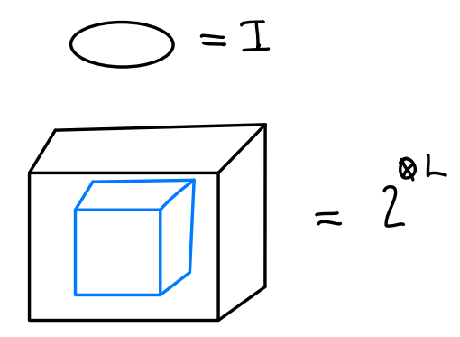

### Code torique

Définissons l'Hamiltonien suivant sur un réseau carré 2D, où $S$ est l'ensemble de sommets et $P$ est l'ensemble de plaquettes:

$$
\hat{H} = - \sum_{S}A_{S} - \sum_{P}B_{P}
$$

$$
\begin{align}
A_{S} &= \prod_{i \in S} X_{i} \\
B_{P} &= \prod_{i \in P} Z_{i}
\end{align}
$$

$$
 [A_{S}, B_{P}] = 0
$$

L'état fondamental est obtenu lorsque $A_{S}=+1$ et $B_{P} = +1$. On a une quasi-particule $e$ si $A_{S} = -1$  et $m$ si $B_{P}$ si $B_{P} = -1$.

On a que $\bar{X}\bar{Z}=-\bar{Z}\bar{X}$, $\bar{X}\bar{Z}' = -\bar{Z}'\bar{X}$, $[\bar{Z},\bar{Z}'] = 0$.

Soit $\ket{a,b}$ l'état fondamental $\bar{Z}$, $\bar{Z}'$. Alors,

$$
\begin{align}
\bar{Z}\ket{a,b} &= a\ket{a,b} \\
\bar{Z}' \ket{a,b} &= b \ket{a,b} \\
\bar{Z}\bar{X} \ket{a,b} &= - \bar{X}\bar{Z}\ket{a,b} = -a\bar{X}\ket{a,b} \equiv \ket{-a,b}
\end{align}
$$

**Dégénérescence du niveau fondamental topologique:**

Il y a 4 état fondamentaux $\ket{\pm 1, \pm 1}$.

L'ordre topologique est ici de $\mathbb{Z}_{2}$ (voir la définition plus bas).

La particule $\varepsilon = m \times e$ est un fermion! Il y a une implémentation du code torique avec des atomes de Rydberg.

**Définition:** L'ordre topologique est un système physique localisé géométriquement dont l'espace des états fondamentaux forme un code de correction d'erreur quantique.

On a ici que l'ordre topologique est de $\mathbb{Z}_{3}$ en 2D.

Le code torique est un ordre topologique $\mathbb{Z}_{2}$ en 3D ($\mathbb{R}^{3}$).

**Théorème (No-go theorems):**

1. L'ordre topologique $\mathbb{Z}_{N}$ n'existe pas en $\mathbb{R}^{2}$.
2. L'ordre topologique $\mathbb{Z}_{N}$ n'existe pas en $\mathbb{R}^{3}$ si on utilise uniquement des particules $e$.

**Théorème:** L'ordre topologique $\mathbb{Z}_{N}$ existe en $\mathbb{R}^{3}$ avec uniquement des particules $m$.

### Codes bosoniques

On cherche à encoder l'information d'un qubit à l'intérieur d'un oscillateur harmonique. 

On sait que $[\hat{x},\hat{p}]=i$.

$$
D(\delta_{x})D(i\delta_{p}) = e^{i\delta_{x}\delta_{p}} D(i\delta_{p}) D(\delta_{x})
$$

$$
e^{i\delta_{x}\delta_{y}} \propto \text{carré rouge} = 2 \pi k, k \in \mathbb{Z}
$$

Le code Gottesman-Kitaev-Preskill (GKP) est donné comme suit:

Stabilisateurs:

$$
\begin{align}
T_{x} &= D(i 2 \sqrt{ \pi }) \\
T_{p} &= D(2\sqrt{ \pi })
\end{align}
$$

où $[T_{x}, T_{p}] = 0$.

On a que

$$
V_{S} = \{ \ket{\psi} \mid T_{x} \ket{\psi} = T_{p} \ket{\psi} = \psi \}
$$

Les états propres de $T_{x}$ sont des états infiniment comprimés en $x$, $2\sqrt{ \pi } k, k \in \mathbb{Z}$. Les états propres de $T_{p}$ sont des états infiniment comprimés en $p$, $2i\sqrt{ \pi }k, k \in \mathbb{Z}$.

*Rajouter le dessin.*

$$
\begin{align}
\ket{0}_{L} &\propto \sum_{j} \ket{\sqrt{ \pi } (2j)}_{x} \\
\ket{1}_{L} &\propto \sum_{j} \ket{\sqrt{ \pi } (2j+1)}_{x}
\end{align}
$$

*Rajouter le dessin.*

On mesure $T_{x} = e^{i 2 \sqrt{ \pi } \hat{x}} \to x_{m} = x \text{mod} \sqrt{ \pi }$. On corrige $D(-x_{m})$.

$$
\begin{align}
\bar{X}_{L} &= e^{i\sqrt{ \pi }\hat{p}} \\
\bar{Z}_{L} &= e^{i\sqrt{ \pi } \hat{x}}
\end{align}
$$

Il s'agit d'opérations gaussiennes, mais on peut toujours appliquer celles-ci à l'aide de portes logiques Clifford.

Les états propres de $T_{x}$ et $T_{p}$ sont états infiniment comprimé, donc on ajoute beaucoup d'énergie dans le système en mesurant $T_{x}$ et $T_{p}$. Pour résoudre ce problème, on utilise le code GKP à énergie finie.

Soit $\hat{E}_{\Delta} = e^{-\Delta^{2} \hat{n}}$ où $\Delta>0$. Alors,

$$
\begin{align}
\ket{0_{\Delta}} &\propto \hat{E}_{\Delta} \ket{0_{L}} \\
\ket{1_{\Delta}} &\propto \hat{E}_{\Delta} \ket{1_{L}}
\end{align}
$$

*Rajouter le dessin.*

$$
\begin{align}
T_{x,\Delta} &= \hat{E}_{\Delta} T_{x} \hat{E}_{\Delta}^{\dagger} \\
&= e^{2i\sqrt{ \pi } (\hat{x}\cosh(\Delta^{2}) + i\hat{p}\sinh(\Delta^{2}))} \\
&\approx e^{2i\sqrt{ \pi }\Delta (\hat{x}/\Delta + i\hat{p}\Delta)}
\end{align}
$$

Cet opérateur n'est pas unitaire et hermitien.

$$
\begin{align}
T_{x,\Delta} \ket{0_{\Delta}} &= \ket{0_{\Delta}} \\
T_{x,\Delta} \ket{1_{\Delta}} &= \ket{1_{\Delta}} \\
[T_{x,\Delta}, T_{p,\Delta}] &= 0
\end{align}
$$

On définit l'opérateur de compression finie $\hat{S}_{\ln(\Delta)}$:

$$
\hat{S}_{\ln(\Delta)}^{\dagger} a 
$$

Les états propres sont:

On a que $\ln(T_{x,\Delta}) \propto \frac{\hat{x}_{m}}{\Delta} + i\hat{p}\Delta$.

$$
\dot{\rho}(t) = \sum_{k} E_{k} (t) \rho(t) E_{k}(t)^{\dagger}
$$

L'équation maîtresse donne

$$
\begin{align}
\dot{\rho} &= \Gamma_{x} D\left[ \frac{\hat{x}_{m}}{\Delta} + i\hat{p}\Delta \right](\rho) + \Gamma_{p} D\left[ \frac{p_{m}}{\Delta} - i\hat{x}\Delta \right](\rho) \\
D(t)(\rho(t)) &= \sum_{j} \gamma_{j}(t)L_{j}\rho L_{j}^{\dagger} - \frac{1}{2}\{ L_{j}^{\dagger}L_{j}\rho \}
\end{align}
$$

où $L$ sont les opérateurs de Lindblad et $D$ est le dissipateur.

On veut implémenter cette équation *Discrétisation + Approximations* en utilisant un seul qubit.

$$
U_{t} = \exp\left( -i \sqrt{ \Gamma_{x}\delta t } \left( \frac{x_{m}\hat{\sigma}_{x}}{\Delta} + \hat{p}\hat{\sigma}_{g}\Delta\right) \right)
$$

En utilisant $e^{A+B} \approx e^{A}e^{B}$ (approximation de premier ordre), on peut définir le protocole de Shavpen-Trim:

Au deuxième ordre,

1. Big-Small-Big (BSB)
2. Small-Big-Small (SBS)

Corrections alternées de $T_{x,\Delta}$ et $T_{p,\Delta}$. Il s'agit du protocole de correction sans mesure, une propriété importante des codes GKP.

La recherche actuelle en correction d'erreur se concentre sur la concaténation des codes de correction d'erreur connus.
