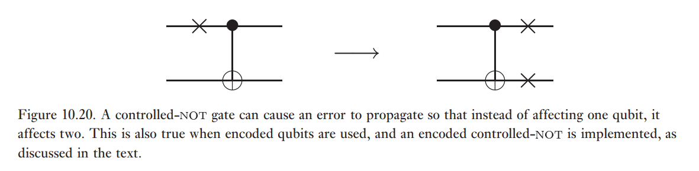
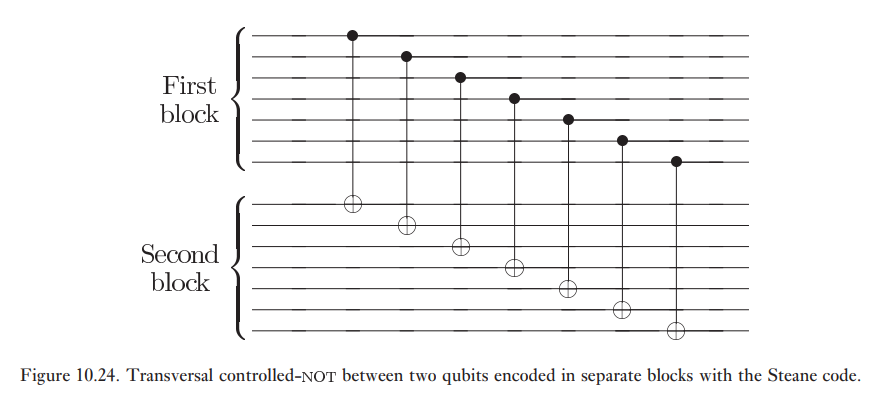
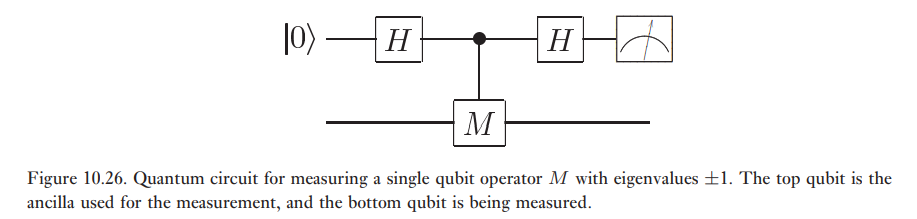
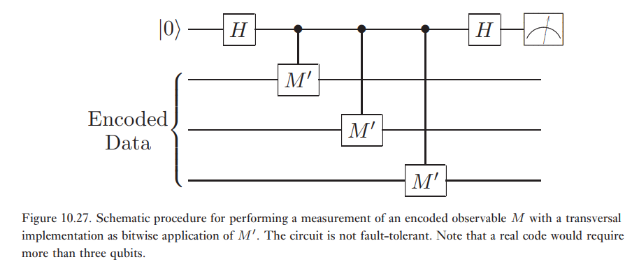
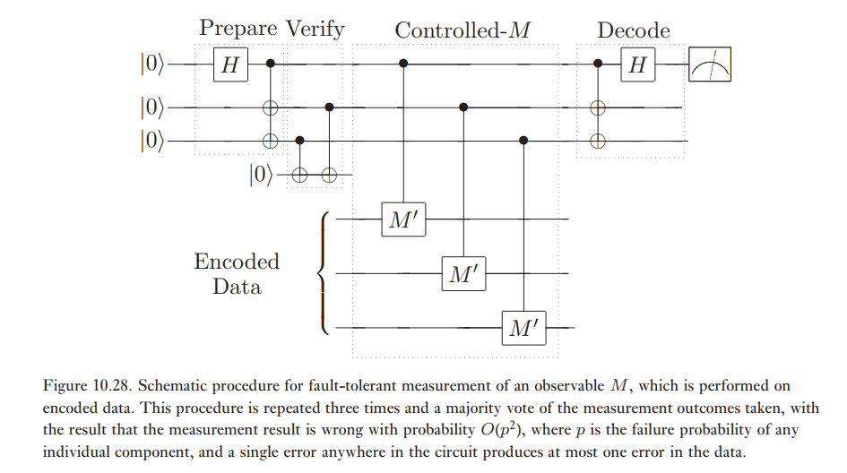

# Calcul quantique tolérant aux fautes

On a besoin de:

- Ensemble universel de portes quantiques tolérantes aux fautes (ex: H, T, CNOT).
- Mesure tolérante aux fautes (ex: préparation d'états logiques)
- Correction d'erreurs

## Prolifération d'erreurs

Supposons qu'on a de l'information stockée parfaitement sur $n$ qubits. Supposons aussi que chaque qubit est susceptible a une erreur avec un taux $p$. 

Quelle est la probabilité d'avoir un certain nombre d'erreurs?

$$
\begin{align}
P_{1} &= np(1-p)^{n-1} = O(np) \\
P_{2} &= \begin{pmatrix}
n \\
2
\end{pmatrix} p^{2}(1-p)^{n-2} = O((np)^{2}) = O(P_{1}^{2})
\end{align}
$$

On remarque que si notre circuit de correction d'erreur peut corriger une erreur, alors il pourrait aussi bien corriger deux erreurs simultanées.

Pour les opérations à plusieurs qubits, on remarque que les erreurs peuvent se propager à travers le circuit par ces opérations. Par exemple, une erreur arrivant sur le qubit contrôle d'un CNOT se propage sur le qubit cible.

## Tolérance aux fautes

**Définition (Composante tolérante aux fautes):**  Une composante, c'est-à-dire une inaction, une porte ou une mesure, cause au pire 1 erreur par bloc encodé avec une probabilité $p$. Alors, la probabilité d'avoir 2 erreurs par bloc est de $O(p^{2})$.

**Théorème (Théorème de seuil):** Un circuit idéal à $n$ qubits comportant $q(n)$ portes peut être simulé sur un ordinateur quantique (non-idéal) dont les composantes introduisent des erreurs avec probabilité $p$ au-dessous d'un seuil $p_{th}$. Une telle simulation requiert $O\left( \text{poly}\left( \log\left( q(n) \right) /\varepsilon \right) q(n) \right)$ portes pour obtenir une probabilité d'erreur $\varepsilon$.

**Exemple:** Soit un code de répétition avec deux qubits logiques.

$$
\begin{align}
\ket{0} &\to \ket{0}_{L} = \ket{000} \\
\ket{1} &\to \ket{1}_{L} = \ket{111}
\end{align}
$$

Supposons un taux d'erreur $p$.

- **Inaction:** Probabilité d'avoir deux erreurs dans un même bloc.

$$
P = O(p^{2})
$$

- **CNOT logique:**  

On remarque que cette implémentation de la porte CNOT est tolérante aux fautes, car si on a une erreur au premier bloc, celle-ci se propagera et affectera un seul qubit dans le deuxième bloc. On pourrait aussi implémenter la porte en utilisant uniquement le premier qubit du premier bloc comme qubit contrôle. Par contre, une erreur sur ce qubit se propagerait sur tous les qubits du deuxième bloc!

## Portes tolérantes aux fautes

Code de Steane: $\bar{X} = X_{1}X_{2}X_{3}X_{4}X_{5}X_{6}X_{7}$, $\bar{Z} = Z_{1}Z_{2}Z_{3}Z_{4}Z_{5}Z_{6}Z_{7}$

**Porte $\bar{H}$:** On souhaite trouver une porte $\bar{H}$ respectant les relations de conjugaison: $\bar{H}\bar{X}\bar{H} = \bar{Z}$ et $\bar{H}\bar{Z}\bar{H} = \bar{X}$. On peut définir $\bar{H}=H_{1}H_{2}H_{3}H_{4}H_{5}H_{6}H_{7}$. Cette opération est correcte car $H_{i}Z_{i}H_{i}=X_{i}$. Elle est aussi tolérante aux fautes car on applique seulement des portes à un qubits. 

**Porte $\bar{CNOT}$:** Voir l'implémentation plus haut. 

## Mesure tolérante aux fautes

Pour préparer un état logique dans un code stabilisateur, on mesure les stabilisateurs. Pour mesurer un opérateur $M$, on utilise le circuit suivant:

On peut considéré $M$ comme un circuit comprenant des portes tolérantes aux fautes.

**Exemple:** $M = M'^{\otimes_{3}}$

On pourrait utiliser le circuit suivant:

Cependant, on remarque que celui-ci n'est pas tolérant aux fautes pour les mêmes raisons que le CNOT. On utilise plutôt le circuit suivant:

**Étapes:**

1. Préparation de l'état auxiliaire: $\ket{0}^{\otimes 3} \to \frac{\ket{000}+\ket{111}}{2}$. *Cette partie n'est pas tolérante aux fautes.*
2. Vérification: mesurer les stabilisateurs $Z_{1}Z_{2},Z_{2}Z_{3},Z_{1}Z_{3}$. *Cette partie n'est pas tolérante aux fautes.*
3. $M$ contrôlé: si la vérification réussit, on applique $M$ contrôlé.
4. Décodage: obtenir qubit auxiliaire logique.
5. Mesure.

**Commentaires:** 

- Aucune erreur ne se transmet des ancillas aux données.
- Erreurs $X$ sur ancillas détectées par vérification.
- Erreurs $Z$ sur ancillas ne sont pas transmises aux données. Par contre, elles causent des erreurs dans la valeur mesurée. Pour corriger ceci, on répète le circuit trois fois et on fait un vote de majorité.

## Portes tolérantes aux fautes (suite)

- **Porte $\bar{T}$:** Cette porte requiert l'état
 
$$
\ket{\theta} = \frac{\ket{0_{L}} + e^{i\pi/4}\ket{1_{L}}}{\sqrt{ 2 }}
$$

On remarque que $\ket{\theta}$ est l'état propre de $e^{-i\pi/4}\bar{S}\bar{X}$ avec valeur propre $+1$. Pour obtenir $\ket{\theta}$, il faut une mesure tolérante aux fautes de $M=e^{-i\pi/4}\bar{S}\bar{X}$. Ensuite,

