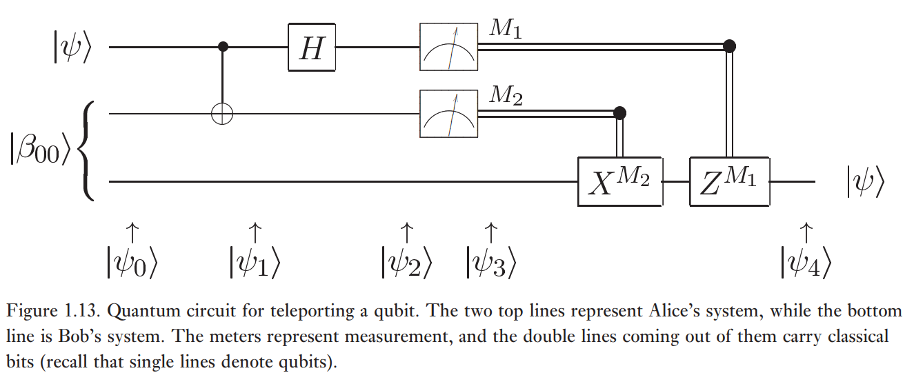
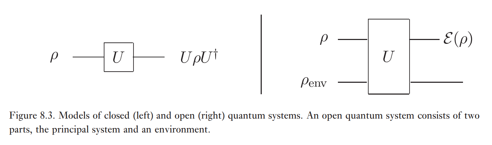
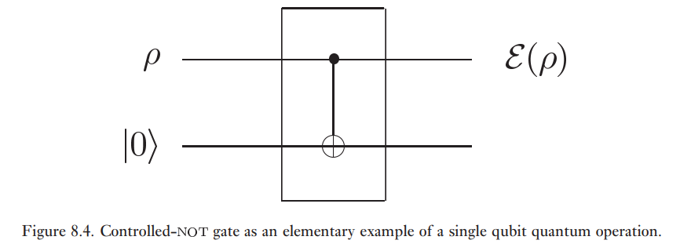

**Exemple (Téléportation quantique):**

Étudions le circuit de téléportation quantique.

Soit l'état initial $\ket{\psi} = \alpha \ket{0} + \beta \ket{1}$. Alors, l'évolution est donnée par:

$$
\begin{align}
\ket{\psi_{0}} &= \frac{1}{\sqrt{ 2 }} (\alpha \ket{0}  (\ket{00} + \ket{11} ) + \beta \ket{1} (\ket{00} + \ket{11} )) \\
\ket{\psi_{1}} &= \frac{1}{\sqrt{ 2 }} (\alpha \ket{0}  (\ket{00} + \ket{11} ) + \beta \ket{1} (\ket{10} + \ket{01} )) \\
\ket{\psi_{2}} &= \frac{1}{\sqrt{ 2}} \left( \frac{\alpha (\ket{0} + \ket{1} )}{\sqrt{ 2 }} (\ket{00} + \ket{11} ) + \frac{\beta (\ket{0} -\ket{1} )}{\sqrt{ 2 }} \right) \\
&= \frac{1}{2} (\ket{00} (\alpha \ket{0} + \beta \ket{1} ) + \ket{01} (\alpha \ket{1} +\beta \ket{0} ) + \ket{10} (\alpha \ket{0} - \beta \ket{1} ) + \ket{11} (\alpha \ket{1} - \beta \ket{0} ))
\end{align}
$$

On a donc que:

- $\ket{00} (\alpha \ket{0} + \beta \ket{1})$ avec prob. $\frac{1}{4}$
- $\ket{01} (\alpha \ket{1} + \beta \ket{0})$ avec prob. $\frac{1}{4}$
- $\ket{10} (\alpha \ket{0} - \beta \ket{1})$ avec prob. $\frac{1}{4}$
- $\ket{11} (\alpha \ket{1} - \beta \ket{0})$ avec prob. $\frac{1}{4}$

Alors,

$$
\begin{align}
\rho &= \frac{1}{4} [\ket{00} \bra{00} (\alpha \ket{0} + \beta \ket{1}) (\alpha^{*} \bra{0} + \beta ^{*} \ket{1}) \\
 &+ \ket{01} \bra{01} (\alpha \ket{1}+ \beta  \ket{0}) (\alpha ^{*} \bra{1} + \beta ^{*} \bra{0}) \\
 &+ \ket{10} \bra{10} (\alpha \ket{0} - \beta \ket{1}) (\alpha ^{*} \bra{0} - \beta ^{*} \bra{1}) \\
 &+ \ket{11} \bra{11} (\alpha \ket{1} - \beta \ket{0}) (\alpha ^{*} \bra{1} - \beta ^{*} \bra{0})]

\end{align}
$$

$$
\begin{align}
\mathrm{Tr}_{A}(\rho) &= \braket{ 00 | \rho | 00 } + \dots + \braket{ 11 | \rho | 11 } \\
&= \frac{1}{4} [(\alpha \ket{0} + \beta \ket{1}) (\alpha ^{*} \bra{0} + \beta ^{*} \bra{1}) \\
&+ (\alpha \ket{1} + \beta \ket{0}) (\alpha ^{*} \bra{1} + \beta ^{*} \bra{0}) \\
&+ (\alpha \ket{0} - \beta \ket{1}) (\alpha ^{*} \bra{0} - \beta ^{*} \bra{1}) \\
&+ (\alpha \ket{1} - \beta \ket{0}) (\alpha ^{*} \bra{1} - \beta ^{*}\bra{0})] \\
&= \frac{1}{4} (2 (\lvert \alpha \rvert^{2} + \lvert \beta \rvert^{2} ) \ket{0} \bra{0} + 2 (\lvert \alpha \rvert^{2} + \lvert \beta \rvert^{2} ) \ket{1} \bra{1}) \\
&= \frac{1}{4} (2 \ket{0} \bra{0} + 2 \ket{1} \bra{1}) \\
&= \frac{1}{2} \mathbb{1}
\end{align}
$$

Cet état n'a aucune dépendance par rapport à l'état $\ket{\psi}$ qui est téléporté et donc toute mesure effectuée par Bob ne contiendra aucune information sur l'état $\ket{\psi}$ empêchant ainsi Alice d'utiliser la téléportation quantique pour transmettre des informations quantiques à Bob plus rapidement que la lumière. Il faut que Alice envoie les résultats de la mesure.

# Opérations quantiques

## Vue d'ensemble

Nous disons que les vecteurs non-normalisés 
$$\ket{\tilde{\psi}_{j}} = \sqrt{ p_{j} } \rho_{j},$$
avec $\rho = \sum_{k} p_{k} \ket{\psi_{k}}\!\bra{\psi_{k}}$, génère la matrice densité $\rho$ si 
$$\rho = \sum_{j} \ket{\tilde{\psi}_{j}}\!\bra{\tilde{\psi}_{j}}$$

**Théorème:** Les ensembles de vecteurs $\{ \ket{\tilde{\psi}_{j}} \}$ et $\{ \ket{\tilde{\varphi}_{j}} \}$ génère la même matrice densité si et seulement s'il existe une matrice unitaire $U$ telle que

$$
\ket{\tilde{\psi}_{j}} = \sum_{j} U_{jj} \ket{\tilde{\varphi}_{j}}
$$

et nous complétons l'ensemble qui est le plus petit avec des vecteurs zéros pour avoir des ensembles de la même taille.

**Preuve:**

$\impliedby$ : Si $\ket{\tilde{\psi}_{j}} = \sum_{j} U_{jj} \ket{\tilde{\varphi}_{j}}$, alors

$$
\begin{align}
\sum_{j} \ket{\tilde{\psi}_{j}}\!\bra{\tilde{\psi}_{j}} &= \sum_{ijk} U_{ij} U_{ik}^{*} \ket{\tilde{\varphi}_{j}}\!\bra{\tilde{\varphi}_{k}} \\
&= \sum_{ijk} U_{ij} U_{kj}^{\dagger} \ket{\tilde{\varphi}_{j}}\!\bra{\tilde{\varphi}_{j}} \\
&= \sum_{jk} \delta_{jk} \ket{\tilde{\varphi}_{j}}\!\bra{\tilde{\varphi}_{k}} \\
&= \sum_{j} \ket{\tilde{\varphi}_{j}}\!\bra{\tilde{\varphi}_{j}}
\end{align}
$$

$\implies$: Soit $A$. Par décomposition spectrale $\ket{\tilde{k}} = \sqrt{ \lambda_{k} } \ket{k}$,

$$
\begin{align}
A &= \sum_{j} \ket{\tilde{\psi}_{j}}\!\bra{\tilde{\psi}_{j}} = \sum_{j} \ket{\tilde{\varphi}_{j}}\!\bra{\tilde{\varphi}_{j}} \\
&= \sum_{k} \lambda_{k} \ket{k}\!\bra{k} = \sum_{k} \ket{\tilde{k}}\!\bra{\tilde{k}} 
\end{align}
$$

On cherche à caractériser les états $\{ \ket{\tilde{\psi}_{j}} \}$ avec les états $\{ \ket{\tilde{k}} \}$ et aussi les $\{ \ket{\tilde{\varphi}_{j}} \}$ avec les états $\{ \ket{\tilde{k}} \}$.

Soit $\ket{\psi}$ un vecteur orthonormal avec $\{ \ket{\tilde{k}} \}_{k}$. Alors, $\braket{ \psi | \tilde{k} }\braket{ \tilde{k} | \psi } = 0 \forall k$, et donc 

$$0 = \braket{ \psi | A | \psi } = \sum_{j} \braket{ \psi | \tilde{\psi}_{j} } \braket{ \tilde{\psi}_{j} | \psi } = \sum_{j} \lvert \braket{ \psi | \tilde{\psi}_{j} } \rvert^{2} \implies \braket{ \psi | \tilde{\psi}_{j} } = 0.$$

Donc, $\ket{\tilde{\psi}_{j}}$ est une combinaison linéaire des $\{ \ket{\tilde{k}} \}_{k}$, disons $\ket{\tilde{\psi}_{j}} = \sum_{k} c_{jk} \ket{\tilde{k}}$. Aussi, $A = \sum_{k} \ket{\tilde{k}}\!\bra{\tilde{k}} = \sum_{j} \ket{\tilde{\psi}_{j}}\!\bra{\tilde{\psi}_{j}}$. Cela implique que

$$
\sum_{k} \ket{\tilde{k}}\!\bra{\tilde{k}} = \sum_{kl} \left( \sum_{j} c_{jk} c_{jl}^{*} \right) \ket{\tilde{k}}\!\bra{\tilde{l}}
$$

Comme les vecteurs $\{ \ket{\tilde{k}}\!\bra{\tilde{l}} \}_{k \neq l}$ sont linéairement indépendants, $\sum_{j} c_{jk} c_{jl}^{*} = \delta_{kl}$. Donc, on peut ajouter des colonnes à $c = (c_{jj})$ en complétant la base pour obtenir une matrice unitaire $V$ telle que

$$
\ket{\tilde{\psi}_{j}} = \sum_{k} v_{jk} \ket{\tilde{k}}.
$$

Aussi, $\ket{\tilde{\varphi}_{j}} = \sum_{j} w_{jk} \ket{\tilde{k}}$ avec $w$ une base unitaire et donc $\ket{\tilde{\psi}_{j}} = \sum_{j} U_{jj} \ket{\tilde{\varphi}_{j}}$ avec $U = V W^{\dagger}$. $\square$
## Environnements et opérations quantiques

**Évolution:** $\rho \to \varepsilon(\rho) = U \rho U^{\dagger}$

**Mesure ($\{ M_{m} \}_{m}$):** $\rho \to \varepsilon_{m} (\rho) = M_{m} \rho M_{m}^{\dagger}$

*La mesure n'est pas nécessairement normalisé.*

Dans un *système quantique fermé*, l'évolution est donné par une matrice unitaire.

Un *système quantique ouvert* est considéré comme le résultat d'une interaction entre le système d'intérêt (principal) et son environnement, qui ensemble forment un système quantique fermé.

En général, l'état final $\varepsilon (\rho)$ n'est pas lié à l'état initial $\rho$ par une transformation unitaire ($\epsilon (\rho) \neq V \rho V^{\dagger}$).

**Définition:** Une *opération quantique* est définie par $\varepsilon(\rho)$ telle que

$$
\varepsilon (\rho) = \mathrm{Tr}_{E}(U(\rho \otimes \rho_{E})U^{\dagger})
$$

Pour le moment, on suppose que le système ouvert commence dans un état produit $\rho \otimes \rho_{E}$ (c'est raisonnable expérimentalement). Après la transformation $U$, le système principal n'interagit plus avec l'environnement. S'il n'y a pas d'interaction, $U = \tilde{U} \otimes \mathbb{1}_{E}$.

**Example:**

En sachant que $U = \text{CNOT}_{1 \to 2} \implies U = \ket{0}\!\bra{0} \otimes \mathbb{1} + \ket{1}\!\bra{1} \otimes X$,

$$
\begin{align}
\varepsilon (\rho) &= \mathrm{Tr}_{E}(U (\rho \otimes \ket{0}\!\bra{0}) U^{\dagger}) \\
&= \braket{ 0_{E} | U (\rho_{P} \otimes  \ket{0}_{E}\!\bra{0}_{E}) U^{\dagger} | 0_{E} } \\
&+ \braket{ 1_{E} | U (\rho_{P} \otimes  \ket{0}_{E}\!\bra{0}_{E}) U^{\dagger} | 1_{E} } \\
&= \braket{ 0_{E} | U | 0_{E} } \rho \braket{ 0_{E} | U | 0_{E} } + \braket{ 1_{E} | U | 0_{E} } \rho \braket{ 0_{E} | U | 1_{E} } \\
&= \ket{0}_{P}\!\bra{0}_{P} \rho \ket{0}_{P}\!\bra{0}_{P} + \ket{1}_{P}\!\bra{1}_{P} \rho \ket{1}_{P}\!\bra{1}_{P} \\
&= \hat{P}_{0} \rho \hat{P}_{0} + \hat{P}_{1} \rho \hat{P}_{1}
\end{align}
$$

où $\hat{P}_{i} = \ket{i}\!\bra{i}$. 

## Représentation de Kraus

Soit $\{ \ket{e_{k}} \}_{k}$ une base de l'environnement (orthonormée) et soit $\rho_{E} = \ket{e_{0}}\!\bra{e_{0}}$ l'état initial de l'environnement. Alors, 

$$
\begin{align}
\varepsilon(\rho) &= \mathrm{Tr}_{E}(U (\rho \otimes  \ket{e_{0}}\!\bra{e_{0}}) U^{\dagger}) \\
&= \sum_{k} \braket{ e_{k} | U (\rho \otimes  \ket{e_{0}}\!\bra{e_{0}}) U^{\dagger} | e_{k} } \\
&= \sum_{k} \braket{ e_{k} | U | e_{0} } \rho\underbrace{  \braket{ e_{0} | U | e_{k} }  }_{ \text{ Représentation de Kraus } }\\
&= \sum_{k} E_{k} \rho E_{k}^{\dagger}
\end{align}
$$

Les opérateurs $\{ E_{k} \}_{k}$ sont appelé les opérateurs de Kraus (les éléments d'opération). Pour tous les états $\rho$, 
$$
\mathbb{1} = \mathrm{Tr}(\varepsilon(\rho)) = \mathrm{Tr}\left( \sum_{k} E_{k} \rho E_{k}^{\dagger} \right) = \mathrm{Tr}\left( \sum_{k} E_{k}^{\dagger} E_{k} \rho \right)
$$

où on a utilisé la cyclicité de la trace. Alors, $\sum_{k} E_{k}^{\dagger} E_{k} = \mathbb{1}$. De plus, $\varepsilon_{m}(\rho) = M_{m} \rho M_{m}^{\dagger}$.

**Définition:** Une *opération quantique* est une opération de la forme
$$
\varepsilon(\rho) = \sum_{k} E_{k} \rho E_{k}^{\dagger}
$$
tel que
$$
\sum_{k} E_{k}^{\dagger} E_{k} \leq \mathbb{1}
$$
**Note:** Les opérateurs $\{ E_{k} \}$ agissent uniquement sur le système principal.

**Exemple:** $U = \hat{\rho}_{0} \otimes \mathbb{1} + \hat{\rho}_{1} \otimes X$

$$
\begin{align}
E_{0} &= \braket{ 0_{E} | U | 0_{E} }= \hat{P}_{0} \\
E_{1} &= \braket{ 1_{E} | U | 0_{E} } = \hat{P}_{1}
\end{align}
$$

**Exemple:** $\varepsilon (p) = P_{0} \rho P_{0}$.

$$
P_{0} = \ket{0}_{P}\!\bra{0}_{P} = \begin{pmatrix}
1 & 0 \\
0 & 0
\end{pmatrix}
$$
$$
\sum_{k} E_{k}^{\dagger} E_{k} = P_{0}^{\dagger} P_{0} = P_{0} < \mathbb{1} 
$$

**Exemple:** $U = \ket{0}_{P}\!\bra{0}_{P} \otimes \mathbb{1}_{E} + \ket{1}_{P}\!\bra{1}_{P} \otimes X_{E}$

$$
\begin{align}
\varepsilon(\rho) &= U(\rho \otimes \ket{0}\!\bra{0}) U^{\dagger} \\
&= U \ket{0}_{E} \rho_{P} \bra{0}_{E} U^{\dagger} \\
&= \ket{0}_{P} \braket{ 0_{P} | 0_{E} } \rho_{P} \braket{ 0_{E} | 0_{P} } \bra{0_{P}} + \ket{1}_{P} \ket{1_{P}}\!\bra{1_{E}} \rho \braket{ 1_{E} | 1_{P} } \bra{1_{P}}
\end{align}
$$
$$
\begin{align}
E_{j}^{\dagger}E_{j} &= \braket{ j_{E} | j_{P} }\braket{ j_{P} | j_{P} } \braket{ j_{P} | j_{E} } \\
&= \braket{ j_{E} | j_{E} } \ket{j_{P}}\!\bra{j_{P}} \\
&= \ket{j_{P}}\!\bra{j_{P}} < \mathbb{1}
\end{align}
$$
$$
\sum_{j} E_{j}^{\dagger} E_{j} = \mathbb{1}
$$