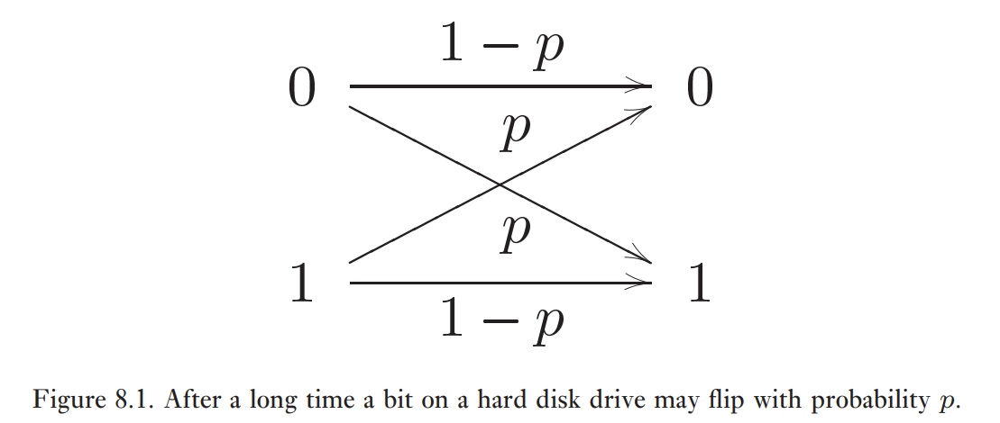

**Exemple:** 

On peut calculer $\varepsilon (\rho)$ de deux manières.

Soit $U = \ket{0}_{P}\!\bra{0}_{P} \otimes \mathbb{1}_{E} + \ket{1}_{P}\!\bra{1}_{P} \otimes X_{E}$
$$
\begin{align}
\varepsilon (\rho) &= \mathrm{Tr}_{P}(U \ket{0_{E}} \rho \bra{0_{E}} U^{\dagger}) \\
&= \braket{ 0_{P} | U | 0_{E} } \rho \braket{ 0_{E} | U^{\dagger} | 0_{P} } + \braket{ 1_{P} | U | 0_{E} }\rho \braket{ 0_{E} | U^{\dagger} | 1_{P} }
\end{align}
$$

$$
\begin{align}
E_{1} &= \braket{ 1_{P} | (\ket{0_{P}}\!\bra{0_{P}} \otimes I_{E} + \ket{1_{P}}\!\bra{1_{P}} \otimes  X_{E}) | 0_{E} } \\
&= \braket{ 1_{P} | 0_{P} }\!\bra{0_{P}} \otimes  \ket{0_{E}} + \braket{ 1_{P} | 1_{P} }\!\bra{1_{P}} \otimes \ket{1_{E}} \\
&= \braket{ 1_{P} | 1_{E} } \\
E_{0} &= \braket{ 0_{P} | (\ket{0_{P}}\!\bra{0_{P}} \otimes I_{E} + \ket{1_{P}}\!\bra{1_{P}} \otimes  X_{E}) | 0_{E} } \\
&= \braket{ 0_{P} | 0_{P} }\!\bra{0_{P}} \otimes  \ket{0_{E}} + \braket{ 0_{P} | 1_{P} }\!\bra{1_{P}} \otimes \ket{1_{E}} \\
&= \braket{ 0_{P} | 0_{E} }
\end{align}
$$

On peut aussi calculer de la manière suivante:

$$
\begin{align}
\varepsilon (\rho) &= \mathrm{Tr}_{E}(SU (\rho \otimes \ket{0}\!\bra{0}) U^{\dagger}S^{\dagger}) \\
&= E_{0}^{1} \rho E_{0}^{{1}^{\dagger}} + E_{1}^{1} \rho E_{1}^{{1}^{\dagger}} 
\end{align}
$$

$$
\begin{align}
E_{1}^{1} &= \braket{ 1_{E} | 1_{P} } \\
E_{0}^{1} &= \braket{ 0_{E} | 0_{P} }
\end{align}
$$

## Mesure et représentation de Kraus

**Cas classique:**

$$
\begin{pmatrix}
y_{0} \\
y_{1}
\end{pmatrix}
= \begin{pmatrix}
1-p & p \\
p & 1-p
\end{pmatrix}
\begin{pmatrix}
x_{0} \\
x_{1}
\end{pmatrix}
$$

**Cas quantique:**

Supposons qu'on mesure l'environnement dans la base $\{  \ket{e_{k}} \}_{k}$ après qu'on applique $U$. Ce type de mesure n'affecte que l'environnement et non le système principal. Soit $\rho_{k}$ l'état du système principal dans le cas qu'on obtient $k$ dans la mesure de l'environnement. Alors,

*Mettre le dessin.*

$$
\begin{align}
\rho_{k} &\propto \mathrm{Tr}_{E}(\hat{\rho}_{K} U (\rho \otimes  \ket{e_{0}}\!\bra{e_{0}}) U^{\dagger} \hat{\rho}_{k}) \\
&= \braket{ e_{k} | U (\rho \otimes \ket{e_{0}}\!\bra{e_{0}}) U^{\dagger} | e_{k} } \\
&= \braket{ e_{k} | U | e_{0} } \rho \braket{ e_{0} | U^{\dagger} | e_{k} }
\end{align}
$$

*Mettre le dessin.*

*Le symbole de proportionnalité est dû au fait que la mesure ne conserve pas la normalisation de la matrice densité ($\rho' \to_{m} M_{m} \rho' M_{m}^{\dagger}$).*

On a que $\rho_{k} \propto E_{k} \rho E_{k}^{\dagger}$. Donc,

$$
\rho_{k} = \frac{E_{k} \rho E_{k}^{\dagger}}{\mathrm{Tr}(E_{k} \rho E_{k}^{\dagger})}
$$

$$
\begin{align}
\mathbb{P}_{\rho'} (k) &= \mathrm{Tr}(\rho' \hat{P}_{k}) \\
&= \mathrm{Tr}(\rho' \ket{e_{k}}\!\bra{e_{k}}) \\
&= \mathrm{Tr}(\bra{e_{k}} \rho' \ket{e_{k}}) \\
&= \mathrm{Tr}(\braket{ e_{k} | U (\rho \otimes  \ket{e_{0}}\!\bra{e_{0}}) U^{\dagger} | e_{k} }) \\
&= \mathrm{Tr}(\braket{ e_{k} | U | e_{0} } \rho \braket{ e_{0} | U^{\dagger} | e_{k} }) \\
&= \mathrm{Tr}(E_{k} \rho E_{k}^{\dagger})
\end{align}
$$

$$
\sum_{K} \mathbb{P} (k) \rho_{k} = \sum_{k} \mathrm{Tr}(E_{k} \rho E_{k}^{\dagger}) \frac{E_{k} \rho E_{k}^{\dagger}}{\mathrm{Tr}(E_{k} \rho E_{k}^{\dagger})} = \sum_{k} E_{k} \rho E_{k}^{\dagger} = \varepsilon (\rho)
$$

L'action de l'opération quantique équivaut à prendre l'état et à le remplacer aléatoirement par $\rho_{k} = \frac{E_{k} \rho E_{k}^{\dagger}}{\mathrm{Tr}(E_{k} \rho E_{k}^{\dagger})}$ avec une probabilité $\mathrm{Tr}(E_{k} \rho E_{k}^{\dagger})$. Classiquement, on parle de canal de bruit. Quantiquement, on appelle les opérations quantiques *canal de bruit quantique*. C'est l'interpétation physique des opérations quantiques. 

**Mesure:** La mesure est décrite par des projecteurs $\{ \hat{P}_{m} \}$. On voudrait décrire l'état du système principal en fonction de l'état initial $\rho$.

*Mettre le dessin.*

L'état final du système est

$$
\frac{\hat{P}_{m} U (\rho \otimes \sigma) U^{\dagger} \hat{P}_{m}}{\mathrm{Tr}(\hat{P}_{m} U (\rho \otimes \sigma) U^{\dagger} \hat{P}_{m})}
$$

si on a mesuré $m$. L'état du système principal est

$$
\frac{\mathrm{Tr}(\hat{P}_{m} U (\rho \otimes \sigma) U^{\dagger} \hat{P}_{m})}{\mathrm{Tr}(\hat{P}_{m} U (\rho \otimes \sigma) U^{\dagger} \hat{P}_{m})}
$$

On définit $\varepsilon_{m} (\rho) = \mathrm{Tr}_{E}( \hat{P}_{m} U (\rho \otimes \sigma) U^{\dagger} \hat{P}_{m})$. Alors, l'état final du système principal est

$$
\frac{\varepsilon_{m} (\rho)}{\mathrm{Tr}(\varepsilon_{m} (\rho))}
$$

$$
\begin{align}
\mathrm{Tr}(\varepsilon_{m} (\rho)) &= \mathrm{Tr}(\hat{P}_{m} U (\rho \otimes  \sigma) U^{\dagger} \hat{P}_{m}) \\
&= \mathrm{Tr}(U (\rho \otimes \sigma) U^{\dagger} \hat{P}_{m}) \\
&= \mathrm{Tr}(\rho'\hat{P}_{m}) \\
&= \mathbb{P}_{\rho'} (m)
\end{align}
$$

*Mettre dessin.*

Soit $\sigma = \sum_{j} q_{j \ket{j}\!\bra{j}}$ sa décomposition spectrale. Soit $\{ \ket{e_{k}} \}_{k}$ une base orthonormée de l'environnement.

$$
\begin{align}
\varepsilon_{m} (\rho) &= \mathrm{Tr}_{E}\left( \hat{P}_{m} U \left( \rho \otimes \sum_{j} q_{j} \ket{j}\!\bra{j} \right) U^{\dagger} \hat{P}_{m} \right) \\
&= \sum_{j} q_{j} \mathrm{Tr}_{E}(\hat{P}_{m} U (\rho \otimes  \ket{j}\!\bra{j}) U^{\dagger} \hat{P}_{m}) \\
&= \sum_{jk} q_{j} \braket{ e_{k} | \hat{P}_{m} U (\rho \otimes  \ket{j}\!\bra{j}) U^{\dagger} \hat{P}_{M} | e_{k} } \\
&= \sum_{jk} q_{j} \braket{ e_{k} | \hat{P}_{m} U | j } \rho \braket{ j | U^{\dagger} \hat{P}_{m} | e_{k} } \\
&= \sum_{jk} E_{jk} \rho E_{jk}^{\dagger}
\end{align}
$$

où $E_{jk} = \sqrt{ q_{j} } \braket{ e_{k} | \hat{P}_{m} U | j }$.

*Mettre dessin.*

Nous montrerons que pour toute opération quantique $\varepsilon$ décrite par les opérateurs $\{ E_{k} \}_{k}$, il existe un modèle d'environnement $E$ commençant dans un état pur $\ket{e_{0}}$, et une dynamique de modèle spécifiée par un opérateur unitaire $U$ et un projecteur $\hat{P}$ sur $E$ tel que

$$
\varepsilon (\rho) = \mathrm{Tr}_{E}(\hat{P} U (\rho \otimes \ket{e_{0}}\!\bra{e_{0}}) U^{\dagger} \hat{P})
$$

$\forall \varepsilon(\rho) = \sum_{k} E_{k} \rho E_{k}^{\dagger}$, $\exists$ un espace d'Hilbert $E$, $\ket{e_{0}} \in E$, $U: P \otimes E \to O \otimes E$ unitaire tel que

$$
\varepsilon (\rho) = \mathrm{Tr}_{E}(\hat{P} U (\rho \otimes \ket{e_{0}}\!\bra{e_{0}}) U^{\dagger} \hat{P})
$$

Supposons que $\sum_{k} E_{k}^{\dagger} E_{k} = \mathbb{1}$. On prend une base de $E$ en correspondance avec $\{ E_{k} \}_{k}$ tel que $E_{k} \leftrightarrow \ket{e_{k}}$. Définissons $U$ par

$$
U (\ket{\psi} \ket{e_{0}}) = \sum_{k} E_{k} \ket{\psi} \ket{e_{k}}
$$

pour un état fixe $\ket{e_{0}} \in E$. Pour des états arbitraires du système principal $\ket{\psi}$, $\ket{\varphi} \in P$.

$$
\braket{ e_{0} | \braket{ \psi | U^{\dagger} U | \varphi } | e_{0} } = \sum_{k} \braket{ \psi | E_{k}^{\dagger} E_{k} | \varphi } = \braket{ \psi | \varphi }
$$

Alors, $U^{\dagger}U = \mathbb{1} = U U^{\dagger}$, et donc $U$ est unitaire. Enfin, 

$$
\begin{align}
\mathrm{Tr}_{E}(U ( \rho \otimes  \ket{e_{0}}\!\bra{e_{0}}) U^{\dagger}) &= \sum_{k} \braket{ e_{k} | U (\rho \otimes  \ket{e_{0}}\!\bra{e_{0}}) U^{\dagger} | e_{k} } \\
&= \sum_{k} \braket{ e_{k} | U \left( \sum_{j} p_{j} \ket{\psi_{j}}\!\bra{\psi_{j}} \otimes  \ket{e_{0}}\!\bra{e_{0}} \right) U^{\dagger} | e_{k} } \\
&=\sum_{kj} p_{j} \braket{ e_{k} | U \ket{\psi_{j}}\!\bra{\psi_{j}} \otimes \ket{e_{0}}\!\bra{e_{0}} U^{\dagger} | e_{k} } \\
\end{align}
$$

Comme $U \ket{\psi} \ket{e_{0}} = \sum_{k} E_{k} \ket{\psi} \ket{e_{k}}$ et $\bra{e_{0}} \bra{\psi} U^{\dagger} = \sum_{k} \bra{e_{k}} \bra{\psi} E_{k}^{\dagger}$, alors

$$
\begin{align}
&= \sum_{kj} p_{j} \braket{ e_{k} | U | \psi_{j} } \ket{e_{0}} \bra{\psi_{j}} \braket{ e_{0} | U^{\dagger} | e_{k} } \\
&= \sum_{kj} p_{j} \braket{ e_{k} | \left( \sum_{i} E_{j} \ket{\psi_{j}} \ket{e_{i}} \right) \left( \sum_{l} \bra{\psi_{j}} \bra{e_{l}} E_{l}^{\dagger} \right) | e_{k} } \\
&= \sum_{kjil} p_{j} \braket{ e_{k} | E_{j} | \psi_{j} } \ket{e_{j}}\bra{\psi_{j}} \braket{ e_{l} | E_{l}^{\dagger} | e_{k} } \\
&= \sum_{kj} p_{j} E_{k} \ket{\psi_{j}}\!\bra{\psi_{j}} E_{k}^{\dagger} \\
&= \sum_{k}E_{k} \left( \sum_{j} P_{j} \ket{\psi_{j}}\!\bra{\psi_{j}} \right) E_{k}^{\dagger} \\
&= \sum_{k} E_{k} \rho E_{k}^{\dagger}
\end{align}
$$

**Cas de la mesure:**

On veut montrer que

$$
\varepsilon_{m} (\rho) = \mathrm{Tr}_{E}(\hat{P}_{m} U (\rho \otimes  \sigma) U^{\dagger} \hat{P}_{m})
$$

On a que $1 = \sum_{m} \mathbb{P}(m) = \sum_{m} \mathrm{Tr}(\varepsilon_{m} (\rho)) = \mathrm{Tr}\left( \sum_{m} \varepsilon_{m} (\rho) \right)$,$\varepsilon_{m} (\rho) = \sum_{k} E_{mk} \rho E_{mk}^{\dagger}$, $\mathrm{Tr}\left( \sum_{m} \varepsilon_{m} \right) = 1 \implies \sum_{mk} E_{mk}^{\dagger} E_{mk} = \mathbb{1}$, $P_{m} = \sum_{k} \ket{m,k}\!\bra{m,k}$. Soit

$$
\begin{align}
\ket{j, k} &\leftrightarrow E_{jk} \\
U \ket{\psi}\ket{e_{0}} &= \sum_{jk} \ket{\psi} \ket{j,k} 
\end{align}
$$

Alors,

$$
\begin{align}
\mathrm{Tr}_{E}(\hat{P}_{m} U (\rho \otimes  \ket{e_{0}}\!\bra{e_{0}}) U^{\dagger} \hat{P}_{m}) &= \mathrm{Tr}_{E}\left( \sum_{k} \ket{m, k}\!\bra{m, k} U \left( \sum_{j} p_{j} \ket{\psi_{j}}\!\bra{\psi_{j}} \right) \otimes  \ket{e_{0}}\!\bra{e_{0}} U^{\dagger} \sum_{k'} \ket{m, k,}\!\bra{m, k,} \right) \\
&= \sum_{jk} p_{j} \braket{ m, k | U | \psi_{j} } \ket{e_{0}}\!\bra{e_{0}} \braket{ \psi_{j} | U^{\dagger} | m, k } \\
&= \sum_{jk} p_{j} \braket{ m, k | \sum_{m'k'} E_{m'k'} \ket{\psi_{j}} \ket{m', k'} \sum_{m''k''} \bra{\psi_{j}} \bra{m'', k''} E_{m''k''}^{\dagger} | m, k } \\
&= \sum_{j} p_{j} E_{mk} \ket{\psi_{j}}\!\bra{\psi_{j}} E_{mk}^{\dagger} \\
&= \sum_{mk} E_{mk} \rho E_{mk}^{\dagger}
\end{align}$$
