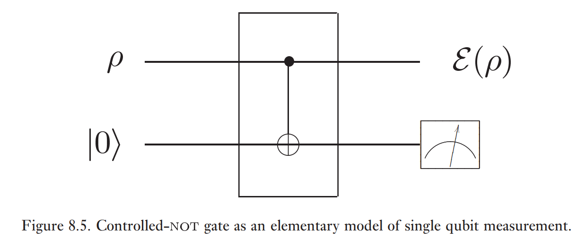

### Rappel

Il y a deux définitions équivalentes d'une opération quantique:

- $\varepsilon(\rho) = \mathrm{Tr}_{E}(U (\rho \otimes \ket{e_{0}}\!\bra{e_{0}}) U^{\dagger})$
- $\varepsilon(\rho) = \sum_{k} E_{k} \rho E_{k}^{\dagger}$, où $\sum_{k} E_{k}^{\dagger} E_{k} \leq I$

**Example:** 

Une opération quantique conserve la trace si $\sum_{k} E_{k}^{\dagger} E_{k} = \mathbb{1}$. On peut alors décrire tout les résultats possible après la mesure. Elle ne conserve pas la trace si $\sum_{k} E_{k}^{\dagger} E_{k} < \mathbb{1}$ et on obtient d'autres résultats après la mesure.

$$
\begin{align}
\varepsilon (\rho) &= \sum_{k} E_{jk} \rho E_{jk}^{\dagger} \\
\sigma_{E} &= \sum_{j} q_{j} \ket{j}\!\bra{j} \\
E_{jk} &= \sqrt{ q_{j} } \braket{ e_{k} | \hat{P}_{m} U | j } \\
&= \braket{ e_{k} | \hat{P}_{m} U | e_{0} }
\end{align}
$$

## Approche axiomatique des opérations quantiques

**Définition:** Une opération quantique est une fonction $\varepsilon: Q_{1} \to Q_{2}$ dans laquelle $Q_{1}$ et $Q_{2}$ sont des espaces de matrices densité tel que:

- **A1** - $\mathrm{Tr}(\varepsilon(\rho))$ est la probabilité que le processus $\varepsilon$ se produise. Alors, $0 \leq \mathrm{Tr}(\varepsilon (\rho)) \leq 1 \ \forall \ \rho \in Q_{1}$.
- **A2** - Convexité linéaire. Si $\sum_{j} p_{j} = 1$ et $p_{j} \in Q_{1}$, alors

$$
\varepsilon\left( \sum_{j} p_{j} \rho_{j} \right) = \sum_{j} p_{j} \varepsilon(\rho_{j})
$$
- **A3** - $\varepsilon$ est une application complètement positive, i.e., si $\rho \in Q_{1}$ est positive ($\braket{ \varphi | \rho | \varphi } \geq 0 \ \forall \ \ket{\varphi}$), $\varepsilon(\rho)$ est positive. De plus, pour un système additionnel $R$, $(\mathcal{I}_{R} \otimes \varepsilon)(A)$ doit être positive si $A$ est positive.

**Exemple:** $\hat{P}_{0} = \ket{0}\!\bra{0}$, $\hat{P}_{1} = \ket{1}\!\bra{1}$,

$$
\begin{align}
\varepsilon(\rho) &= \varepsilon_{0}(\rho) + \varepsilon_{1}(\rho) = \hat{P}_{0} \rho \hat{P}_{0} + \hat{P}_{1} \rho \hat{P}_{1} \\
\mathrm{Tr}(\varepsilon_{0}(\rho)) &= \mathrm{Tr}(\hat{P}_{0} \rho \hat{P}_{0}) = \mathrm{Tr}(\rho \hat{P}_{0} \hat{P}_{0}) = \mathrm{Tr}(\rho \hat{P}_{0}) = \mathbb{P}_{\rho} (0)
\end{align}
$$

L'état final est $\frac{\varepsilon_{j} (\rho)}{\mathrm{Tr}(\varepsilon_{j}(\rho))}$, $j=0,1$.

**Définition:** Une opération quantique $\varepsilon$ est physique si $0 \leq \mathrm{Tr}(\varepsilon(\rho)) \leq 1 \ \forall \ \rho$ (**A1**). Pour **A2**, soit $\rho = \sum_{j} p_{j} \rho_{j}$. On espère que l'état résultant, $\frac{\varepsilon(\rho)}{\mathrm{Tr}(\varepsilon(\rho))} = \frac{\varepsilon(\rho)}{\mathbb{P}(\varepsilon)}$, soit un choix aléatoire de l'ensemble $\left\{  \mathbb{P}(j | \varepsilon), \frac{\varepsilon(\rho_{j})}{\mathrm{Tr}(\varepsilon(\rho_{j}))}  \right\}$ dans lequel $\mathbb{P}(j | \varepsilon)$ est la probabilité que l'état préparé est $p_{j}$ étant donné que le processus $\varepsilon$ se produise. Donc, on demande que

$$
\varepsilon(\rho) = \mathbb{P}(\varepsilon) \sum_{j} \mathbb{P}(j|\varepsilon) \frac{\varepsilon(\rho_{j})}{\mathrm{Tr}(\varepsilon(\rho_{j}))}
$$

avec $\mathbb{P}(\varepsilon) = \mathrm{Tr}(\varepsilon(\rho))$ est la probabilité que le processus $\varepsilon$ se produise dans l'entrée $\rho$. Par la loi de Bayes,

$$
\mathbb{P}(j|\varepsilon) = \mathbb{P}(\varepsilon|j) \frac{p_{j}}{\mathbb{P}(\varepsilon)}.
$$

On a que $\mathbb{P}(\varepsilon|j) = \mathrm{Tr}(\varepsilon(\rho_{j}))$, donc

$$
\begin{align}
\mathbb{P}(j|\varepsilon) &= \frac{p_{j} \mathrm{Tr}(\varepsilon(\rho_{i}))}{\mathbb{P}(\varepsilon)}
\end{align}
$$

Alors,

$$
\varepsilon(\rho) = \mathbb{P}(\varepsilon) \sum_{j} \frac{p_{j} \mathrm{Tr}(\varepsilon(\rho_{j}))}{\mathbb{P}(\varepsilon)} \frac{\varepsilon(\rho_{j})}{\mathrm{Tr}(\varepsilon(\rho_{j}))}
$$

Pour **A3**, cela dit que $\varepsilon(\rho)$ doit être une matrice densité (pas nécessairement normalisée). Si $\rho_{RQ}$, agit dans un système conjoint $RQ$, et si $\varepsilon$ agit sur $Q$, alors $\varepsilon(\rho_{RQ})$ doit être une matrice densité valide dans le système $RQ$.

**Théorème:** Une application $\varepsilon: Q_{1} \to Q_{2}$ satisfait **A1**, **A2** et **A3** si et seulement si $\varepsilon(\rho) = \sum_{j} E_{j} \rho E_{j}^{\dagger}$ pour des opérateurs $\{ E_{j} \}_{j}$ avec $\sum_{j} E_{j}^{\dagger}E_{j} \leq \mathbb{1}$.

**Preuve:** 

- $\impliedby$: **A1** $\forall \ \rho$.

$$
\mathrm{Tr}(\varepsilon(\rho)) = \sum_{j} \mathrm{Tr}(E_{j} \rho E_{j}^{\dagger}) = \sum_{j} \mathrm{Tr}(E_{j}^{\dagger}E_{j} \rho)
$$

mais $\sum_{j} E_{j}^{\dagger} E_{j} = \mathbb{1}$ et donc $0 \leq \mathrm{Tr}(\varepsilon(\rho)) \leq 1$.

**A2**.

$$
\begin{align}
\varepsilon\left( \sum_{k} p_{k} \rho_{k} \right) &= \sum_{j} E_{j} \left( \sum_{k} p_{k} \rho_{k} \right) E_{j}^{\dagger} \\
&= \sum_{jk} p_{k} E_{j} \rho_{k} E_{j}^{\dagger} \\
&= \sum_{k} p_{k} \varepsilon(\rho_{k})
\end{align}
$$

**A3**. Soit $A$ un opérateur positif dans un système $RQ$ et soit $\ket{\psi}$ un état dans $RQ$. Soit $\ket{\varphi_{j}} = (\mathcal{I}_{R} \otimes E_{j}^{\dagger}) \ket{\psi}$. Alors,

$$
\begin{align}
\braket{ \psi | (\mathcal{I}_{R} \otimes  E_{j}) A (\mathcal{I}_{R} \otimes  E_{j}^{\dagger}) | \psi } &= \braket{ \varphi_{j} | A | \varphi_{j} } \geq 0 \\
(\mathcal{I}_{R} \otimes  \varepsilon)(A) &= \sum_{j} (\mathcal{I}_{R} \otimes  E_{j}) A (\mathcal{I}_{R} \otimes  E_{j}^{\dagger})
\end{align}
$$

Donc, $\braket{ \psi | (\mathcal{I}_{R} \otimes  \varepsilon) (A) | \psi } = \sum_{j} \braket{ \varphi_{j} | A | \varphi_{j} } \geq 0$.

- $\implies$: Supposons que $\varepsilon$ satisfait **A1**, **A2**, **A3**. Soit $R$ un système de la même dimension que le système $Q$. Soit $\{ \ket{j_{R}} \}$ et $\{  \ket{j}_{Q} \}$ des bases orthonormées pour $R$ et $Q$, respectivement. On définit $\alpha$ et $\sigma$ ($\sigma$ est la représentation de Choi).

$$
\begin{align}
\alpha &:= \sum_{i} \ket{i_{R}} \ket{i_{Q}} \text{ (pas normalisé)}\\
\sigma &:= (\mathcal{I}_{R} \otimes  \varepsilon) (\ket{\alpha}\!\bra{\alpha}) \\
&= (\mathcal{I}_{R} \otimes  \varepsilon) \left( \sum_{i} \ket{i_{R}} \ket{i_{Q}} \sum_{j} \bra{j_{R}} \bra{j_{Q}} \right) \\
&= (\mathcal{I}_{R} \otimes  \varepsilon) \left( \sum_{ij} \ket{i_{R}} \ket{i_{Q}} \bra{j_{R}} \bra{j_{Q}} \right) \\
&= (\mathcal{I}_{R} \otimes  \varepsilon) \left( \sum_{ij} \ket{i_{R}}\!\bra{j_{R}} \otimes  \ket{i_{Q}}\!\bra{j_{Q}} \right) \\
&= \sum_{ij} \ket{i_{R}}\!\bra{j_{R}} \otimes  \varepsilon(\ket{i_{Q}}\!\bra{j_{Q}})
\end{align}
$$

Soit $\ket{\psi} = \sum_{j} \psi_{j} \ket{j_{Q}}$ un état arbitraire dans $Q$. On va associer un état sur $R$ $\ket{\tilde{\psi}} = \sum_{i} \psi_{i}^\star \ket{j_{i}}$. Donc,

$$
\begin{align}
\braket{ \tilde{\psi} | \sigma | \tilde{\psi} } &= \braket{ \tilde{\psi} |\left(  \sum_{ij} \ket{i_{R}}\!\bra{j_{R}} \otimes \varepsilon(\ket{i_{Q}}\!\bra{j_{Q}})  \right) | \tilde{\psi} } \\
&= \sum_{ij} \psi_{j} \tilde{\psi}_{j} \varepsilon(\ket{i_{Q}}\!\bra{j_{Q}}) \\
&= \varepsilon(\ket{\psi}\!\bra{\psi})
\end{align}
$$

On va utiliser une expression $\sigma = \sum_{i} \ket{s_{i}}\!\bra{s_{i}}$ (pas normalisée). Définissons $E_{j} (\ket{\psi}) = \braket{ \tilde{\psi} | s_{i} }$. *$E_{j}$ est linéaire.* Soit $\ket{\psi} = \sum_{i} \psi_{i} \ket{i_{Q}}$ et $\varphi = \sum_{i} \varphi_{i} \ket{ i_{Q}}$.

$$
\begin{align}
\ket{\psi + \varphi} &= \sum_{i} (\psi_{i} + \varphi_{i}) \ket{i_{Q}} \\
\tilde{\ket{\psi + \varphi}} &= \sum_{i} (\psi_{i} + \varphi_{i})^\star \ket{i_{R}} = \ket{\tilde{\psi}} + \ket{\tilde{\varphi}}
\end{align}
$$

$$
\begin{align}
\sum_{i} E_{i} \ket{\psi}\!\bra{\psi} E_{i}^{\dagger} &= \sum_{i} \braket{ \tilde{\psi} | s_{i} } \braket{ s_{i} | \tilde{\psi} } \\
&= \braket{ \tilde{\psi} | \sigma | \tilde{\psi} } \\
&= \varepsilon (\ket{\psi}\!\bra{\psi})
\end{align}
$$

Donc, $\varepsilon(\rho) = \sum_{i} E_{j} \rho E_{j}^{\dagger}$ pour des états purs $\rho$. En raison de **A2**, aussi pour des états mixtes. Comme $\mathrm{Tr}(\varepsilon(\rho))$ est une probabilité, $0 \leq \mathrm{Tr}(\varepsilon(\rho)) \leq 1 \ \forall \ \rho$. Mais, $\mathrm{Tr}(\varepsilon(\rho)) = \sum_{i} \mathrm{Tr}(E_{i}^{\dagger}E_{i} \rho) \ \forall \ \rho \implies \sum_{i} E_{i}^{\dagger}E_{i} \leq \mathbb{1}$. $\square$

Il y a donc 4 définitions d'opération quantique:

1. $\varepsilon(\rho) = \mathrm{Tr}_{E}(U (\rho \otimes \ket{e_{0}}\!\bra{e_{0}}) U^{\dagger})$
2. $\varepsilon(\rho) = \sum_{i} E_{i} \rho E_{i}^{\dagger}$
3. $\varepsilon$ tel que **A1**, **A2**, **A3**
4. Choi

**Exemple:** $\varepsilon(\rho) = \sum_{k} E_{k} \rho E_{k}^{\dagger}$, $F(\rho) = \sum_{k} F_{k} \rho F_{k}^{\dagger}$ avec $E_{1} = \frac{\mathbb{1}}{\sqrt{ 2 }}$, $E_{2} = \frac{Z}{\sqrt{ 2 }}$, $F_{1} = \ket{0}\!\bra{0}$, $F_{2} = \ket{1}\!\bra{1}$. Alors,

$$
\begin{align}
F_{1} &= \frac{E_{1} + E_{2}}{\sqrt{ 2 }}, F_{2} = \frac{E_{1}-E_{2}}{\sqrt{ 2 }} \\
F(\rho) &= \frac{(E_{1}+E_{2}) \rho (E_{1}^{\dagger} + E_{2}^{\dagger}) + (E_{1}-E_{2}) \rho (E_{1}^{\dagger}-E_{2}^{\dagger})}{2} \\
&= E_{1}\rho E_{1}^{\dagger} + E_{2}\rho E_{2}^{\dagger} \\
&= \varepsilon(\rho)
\end{align}
$$

La représentation de Kraus n'est pas unique!

Ici, $E_{k} = \braket{ e_{k} | U | e_{0} }$,

$$
\begin{align}
F_{k} &= \braket{ e_{k} | (\mathbb{1}_{p} \otimes U_{E}') U | e_{0} } \\
&= \braket{ e_{k} | (\mathbb{1}_{p} \otimes  U_{E}') \sum_{j} \ket{e_{J}}\!\bra{e_{J}} U | e_{0} } \\
&= \sum_{j} \braket{ e_{k} | \mathbb{1}_{p} \otimes  U_{E}' | e_{j} } \braket{ e_{j} | U | e_{0} } \\
&= \sum_{j} U_{kj}' E_{j}
\end{align}
$$

**Théorème:** Soit $\varepsilon(\rho) = \sum_{k=1}^{m} E_{k}\rho E_{k}^{\dagger}$ et $F(\rho) = \sum_{k=1}^{m} F_{k}\rho F_k^{\dagger}$ des opérations quantiques ajoutant des opérateurs zéros à la liste moins long en supposant que $n=m$. Alors, $\varepsilon = F \iff \exists U = (\mu_{ij})$ unitaire complexe telle que $E_{i} = \sum_{j} \mu_{ij} F_{j} \ \forall \ j=1, \dots, n$.

**Preuve:** 

- $\implies$: Supposons que $\varepsilon(\rho) = F(\rho) \ \forall \ \rho$. Définissons

$$
\begin{align}
\ket{e_{i}} &= \sum_{k} \ket{k_{R}} E_{i} \ket{k_{Q}} = (\mathcal{I} \otimes  E_{j}) \ket{\alpha} \\
\ket{f_{i}} &= \sum_{k} \ket{k_{R}} F_{i} \ket{k_{Q}} = (\mathcal{I} \otimes  F_{j}) \ket{\alpha}
\end{align}
$$

On prend encore $\ket{\alpha} = \sum_{k} \ket{k_{R}} \ket{k_{Q}}$ et $\sigma = (\mathcal{I}_{R} \otimes \varepsilon) (\ket{\alpha}\!\bra{\alpha}) = \sum_{i} \ket{e_{i}}\!\bra{e_{i}} = \sum_{i} \ket{f_{i}}\!\bra{f_{i}}$. On a deux mélanges statistiques qui représentent le même état mixte $\sigma = \sum_{i} \ket{e_{i}}\!\bra{e_{i}} = \sum_{i} \ket{f_{i}}\!\bra{f_{i}}$. Donc, il existe une matrice unitaire $U = (\mu_{ij})$ tel que $\ket{e_{i}} - \sum_{j} \mu_{ij} \ket{f_{j}}$. Finalement, pour un état arbitraire $\ket{\psi}$, 

$$
\begin{align}
E_{j} \ket{\psi} &= \braket{ \tilde{\psi} | e_{j} } \\
&= \sum_{j} \mu_{ij} \braket{ \tilde{\psi} | f_{j} } \\
&= \sum_{j} \mu_{ij} F_{j} \ket{\psi} \\
\end{align}
$$

- $\impliedby$:

$$
\begin{align}
\varepsilon(\rho) &= \sum_{i} E_{i} \rho E_{i}^{\dagger} \\
&= \sum_{i} \left( \sum_{j} \mu_{ij} F_{j} \right) \rho \left( \sum_{j'} \mu_{ij'} F_{j'} \right)^{\dagger} \\
&= \sum_{ijj'} \mu_{ij} \mu_{ij'}^{\star} F_{i} \rho F_{j}^{\dagger} \\
&= \sum_{ijj'} \mu_{ij} (\mu ^{\dagger})_{j'i} F_{i} \rho F_{j}^{\dagger} \\
&= \sum_{jj'} F_{j} \rho F_{j'}^{\dagger} \left( \sum_{j} \mu_{ij} \mu_{ij'}^{\dagger} \right) \\
&= \sum_{j} F_{j} \rho F_{j}^{\dagger} \\
&= F(\rho)
\end{align}
$$

où on a utilisé $\sum_{i} \mu_{ij} \mu_{j'j}^{\dagger} = \{ 1 \text{ si } j = j' \text{ et } 0 \text{ si } j \neq j' \}$. $\square$
