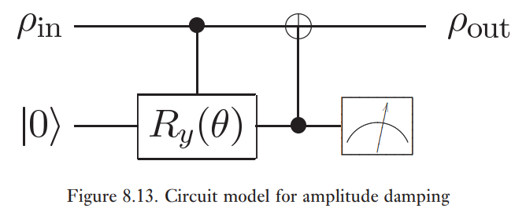
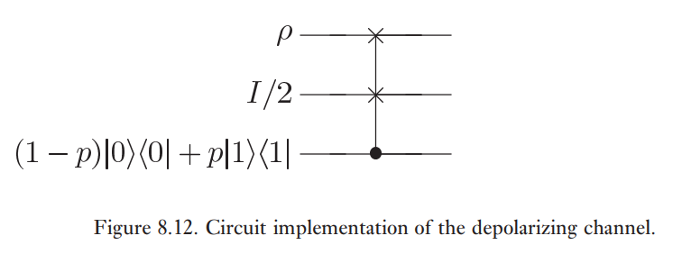

# Examples de bruit quantique et d'opérations quantiques

## Trace et trace partielle

**Example (trace):** 

La trace se définit comme une opération par l'opération $\rho \to \mathrm{Tr}(\rho)$. Définissons

$$
\begin{align}
\mathrm{Tr}: \ &Q_{N} \to \mathbb{R} \\
&\ket{j}\!\bra{j} \to \ket{0}
\end{align}
$$

et $E_{j} = \ket{0}\!\bra{j}$.

$$
\begin{align}
\varepsilon(\rho) &= \sum_{j} \ket{0}\!\bra{j} \rho \ket{j}\!\bra{0} \\
&= \ket{0} \sum_{j} \braket{ j | \rho | j } \ket{0} \\
&= \mathrm{Tr}(\rho) \ket{0}\!\bra{0} \\
&= \sum_{j} E_{j} \rho E_{j}^{\dagger}
\end{align}
$$

Donc, $\mathrm{Tr}$ est une opération quantique qui préserve la trace.

$$
\sum_{j} E_{j}^{\dagger}E_{j} = \sum_{j} \braket{ j | 0 }\braket{ 0 | j } = \sum_{j} \braket{ 0 |j  } \braket{ j | 0 } = \bra{0}\sum_{j}\ket{j}\!\bra{j}\ket{00} = \braket{ 0 | 0 } = 1
$$

Considérons un système QR tel que $Q \to \{ \ket{j}_{Q} \}_{j}$ et $R \to \{ \ket{i}_{R} \}_{j}$, $E_{i} \left( \sum_{j} \lambda_{j} \ket{q_{j}}_{Q} \ket{j}_{R} \right) = \lambda_{i} \ket{q_{i}}_{Q}$, $\varepsilon(\rho) = \sum_{i} E_{i} \rho E_{i}^{\dagger}$, $\rho = \sum_{k} p_{k} \rho_{k}$.

$$
\begin{align}
\varepsilon(\rho \otimes \ket{j}\!\bra{j'}) &= \sum_{i} E_{i} \rho \otimes \ket{j}\!\bra{j'} E_{i}^{\dagger} \\
&= \sum_{i} E_{i} \sum_{k} p_{k} \ket{\psi_{k}}\!\bra{\psi_{k}} \ket{j}\!\bra{j'} E_{i}^{\dagger} \\
&= \sum_{ik} p_{k} E_{i} \ket{\psi_{k}}\ket{j}\!\bra{j'} \bra{\psi_{k}} E_{i}^{\dagger} \\
&= \sum_{ik} p_{k} \delta_{ij} \ket{\psi_{k}}\!\bra{\psi_{k}} \delta_{ij'} \\
&= \left( \sum_{i} \delta_{ij} \delta_{ij'} \right) \sum_{k} p_{k} \rho_{k} \\
&= \delta_{jj'} \rho
\end{align}
$$

$$
\begin{align}
\mathrm{Tr}_{R}(\rho \otimes  \ket{j}\!\bra{j'}) &= \sum_{l} \bra{l} \rho \otimes \ket{j}\!\bra{j'} \ket{l} \\
&= \sum_{l} \braket{ l | j } \rho \braket{ j' | l } \\
&= \sum_{l} \delta_{lj} \delta_{j'l} \rho \\
&= \delta_{jj'} \rho
\end{align}
$$

## Canaux de bit flip et de phase flip

**Bit flip:**

On applique une porte $X$ avec une probabilité $(1-p)$ tel que $p \rho + (1-p)X\rho X$.

$$
E_{0} = \sqrt{ p }I = \sqrt{ p } \begin{pmatrix}
1 & 0 \\
0 & 1
\end{pmatrix}, \
E_{1} = \sqrt{ 1-p }X = \sqrt{ 1-p}\begin{pmatrix}
0 & 1 \\
1 & 0
\end{pmatrix}
$$

*Pas fini.*

**Phase flip:**

On applique une porte $Z$ avec une probabilité $(1-p)$ tel que $p \rho + (1-p)Z\rho Z$.

$$
E_{0} = \sqrt{ p }I = \sqrt{ p } \begin{pmatrix}
1 & 0 \\
0 & 1
\end{pmatrix}, \
E_{1} = \sqrt{ 1-p }Z = \sqrt{ 1-p}\begin{pmatrix}
1 & 0 \\
0 & -1
\end{pmatrix}
$$
**Bit-phase flip:**

On applique une porte $Y$, i.e. une combinaison des portes X et Y ($Y = iXZ$) avec une probabilité $(1-p)$ tel que $p \rho + (1-p)Y\rho Y$.

$$
E_{0} = \sqrt{ p }I = \sqrt{ p } \begin{pmatrix}
1 & 0 \\
0 & 1
\end{pmatrix}, \
E_{1} = \sqrt{ 1-p }Z = \sqrt{ 1-p}\begin{pmatrix}
0 & -i \\
i & 0
\end{pmatrix}
$$

## Description de la dissipation d'énergie

- La dynamique d'un atome en émission spontanée d'un photon.
- L'approche de l'équilibre thermodynamique d'un système de spin à haute température avec son environnement.
- L'état d'un photon dans un interféromètre ou une cavité soumis aux effets de diffusion et d'atténuation.

Le comportement général de ces systèmes est bien caractérisé par une opération quantique appelé *amortissement d'amplitude*. Supposons que nous avons un mode optique unique contenant l'état $a\ket{0} + b\ket{1}$, une superposition zéro et d'un photon. La diffusion d'un photon à partir de ce mode peut être modélisée en insérant un miroir semi-argenté et un diviseur de faisceau dans le chemin du photon. Ce diviseur de faisceau permet au photon de se coupler à un autre mode optique unique (représentant l'environnement) selon la transformation.

$$
B = \exp(\theta [\hat{a}^{\dagger}\hat{b} - \hat{a}\hat{b}^{\dagger}])
$$

où $\hat{a}, \hat{a}^{\dagger}, \hat{b}, \hat{b}^{\dagger}$ sont les opérateurs d'annihilation et de création de photons pour les deux modes. 

La sortie après le diviseur de faisceau est

$$
\begin{align}
\rho = B \ket{0} (a\ket{0} + b\ket{1}) &= a\ket{00} + b(\cos(\theta)\ket{01} + \sin(\theta)\ket{10})
\end{align}
$$

$$
\begin{align}
\mathrm{Tr}_{E}(\rho) &= \mathrm{Tr}_{E}([a\ket{00}+b\cos(\theta)\ket{01}+b\sin(\theta)\ket{10}] [a^{\star}\bra{00}+b^{\star}\cos(\theta)\bra{01}+b^{\star}\sin(\theta)\bra{10}]) \\
&= \dots \\
&= aa^{\star}\ket{0}\!\bra{0} + ba^{\star}  \ket{1}\!\bra{0} + bb^{\star}\cos ^{2}(\theta) \ket{1}\!\bra{1} + ab^{\star}\cos ^{2} (\theta) \ket{0}\!\bra{1} + bb^{\star}\sin ^{2}(\theta)\ket{0}\!\bra{0}
\end{align}
$$

$$
\rho^{A} = \mathrm{Tr}_{E}(\rho) = \begin{pmatrix}
aa^{\star}+bb^{\star}\sin ^{2}(\theta) & ab^{\star}\cos(\theta) \\
a^{\star}b\cos(\theta) & bb^{\star}\cos ^{2}(\theta)
\end{pmatrix}
$$

Soit $\hat{P}_{0} = \ket{0}\!\bra{0}$ et $\hat{P}_{1} = \ket{1}\!\bra{1}$. On a que 

$$
\frac{1}{2} \rho \otimes I \otimes ((1-p)\hat{P}_{0} + p \hat{P}_{1} = \frac{1-p}{2} \rho \otimes I \otimes \hat{P}_{0} + \frac{p}{2} \rho \otimes I \otimes \hat{P}_{1}
$$

Donc, $U = I \otimes I \otimes \hat{P}_{0} + S\otimes \hat{P}_{1}$.

$$
\begin{align}
\rho' &= (I^{\otimes 2} \otimes  \hat{P}_{0} + S \otimes  \hat{P}_{1})\left( \frac{1-p}{2} \rho \otimes I \otimes \hat{P}_{0} + \frac{p}{2} \rho \otimes I \otimes \hat{P}_{1} \right)(I^{\otimes 2} \otimes \hat{P}_{0} + S \otimes  \hat{P}_{1}) \\
 \\
&= \frac{1-p}{2} I^{\otimes 2} \otimes  \hat{P}_{0} (\rho \otimes I \otimes \hat{P}_{0}) (I^{\otimes 2}\otimes \hat{P}_{0}) + \frac{p}{2} S \otimes \hat{P}_{1} (\rho \otimes I \otimes \hat{P}_{1}) S\otimes \hat{P}_{1} \\
&= \frac{1-p}{2} \rho \otimes I \otimes  \hat{P}_{0} + \frac{p}{2} S (\rho \otimes I) \otimes  \hat{P}_{1} \\
&= \frac{1-p}{2} \rho \otimes  I \otimes  \hat{P}_{0} + \frac{p}{2} I \otimes  \rho \otimes  \hat{P}_{1} \\
&= \frac{1-p}{2} \rho \otimes  \hat{P}_{0} \otimes  \hat{P}_{0} + \frac{1-p}{2} \rho \otimes  \hat{P}_{1} \otimes  \hat{P}_{0} + \frac{p}{2} \hat{P}_{0} \otimes \rho \otimes \hat{P}_{1} + \frac{p}{2} \hat{P}_{1} \otimes  \rho \otimes \hat{P}_{1}
\end{align}
$$

où on a utilisé que $I = \hat{P}_{0} + \hat{P}_{1}$ et que
$$
\begin{align}
S(\rho \otimes  I)S &= S \left( \sum_{k} p_{k} \ket{\psi_{k}}\!\bra{\psi_{k}} \otimes  \ket{0}\!\bra{0} + \sum_{k} p_{k} \ket{\psi_{k}}\!\bra{\psi_{k}} \otimes  \ket{1}\!\bra{1} \right) S \\
&= \sum_{k} p_{k} S \ket{\psi_{k}}\!\bra{\psi_{k}} \ket{0}\!\bra{0} S + \sum_{k} p_{k} S \ket{\psi_{k}}\!\bra{\psi_{k}} \ket{1}\!\bra{1} S \\
&= \sum_{k} p_{k} S \ket{\psi_{k}}\ket{0}\bra{\psi_{k}}\bra{0}S + \sum_{k} p_{k} S \ket{\psi_{k}} \ket{1}\bra{\psi_{k}}\bra{1}S \\
&= \sum_{k} p_{k} \ket{0} \ket{\psi_{k}}\bra{0} \bra{\psi_{k}} + \sum_{k} p_{k} \ket{1} \ket{\psi_{k}}\bra{1} \bra{\psi_{k}} \\
&= \dots \\ \\
&= (\ket{0}\bra{0} + \ket{1}\bra{1}) \otimes \sum_{k} p_{k} \ket{\psi_{k}}\bra{\psi_{k}} \\
&= I \otimes \rho
\end{align}
$$

On calcule alors que

$$
\begin{align}
\mathrm{Tr}_{E}(\rho \otimes  \hat{P}_{0} \otimes  \hat{P}_{0}) &= \braket{ 00 | (\rho \otimes \ket{0}\bra{0} \otimes \ket{0}\bra{0}) | 00 } + \braket{ 01 | \dots | 01 } + \braket{ 10 | \dots | 10 } + \braket{ 11 | \dots | 11 }  \\
&= \rho \\
\mathrm{Tr}_{E}(\rho \otimes  \hat{P}_{1} \otimes  \hat{P}_{0}) &= \braket{ 00 | (\rho \otimes \ket{1}\bra{1} \otimes \ket{0}\bra{0}) | 00 } + \braket{ 01 | \dots | 01 } + \braket{ 10 | \dots | 10 } + \braket{ 11 | \dots | 11 } \\
&= \rho \\
\mathrm{Tr}_{E}(\hat{P}_{0} \otimes  \rho \otimes \hat{P}_{1}) &= \braket{ 00 | (\ket{0}\bra{0} \otimes \rho \otimes  \ket{1}\bra{1}) | 00 } + \braket{ 01 | \dots | 01 } + \braket{ 10 | \dots | 10 } + \braket{ 11 | \dots | 11 }  \\ \\
&= \hat{P}_{0} (\braket{ 0 | \rho | 0 } + \braket{ 1 | \rho | 1 }) = \hat{P}_{0} \mathrm{Tr}(\rho) = \hat{P}_{0}\\
\mathrm{Tr}_{E}(\hat{P}_{1} \otimes  \rho \otimes \hat{P}_{1}) &= \braket{ 00 | (\ket{1}\bra{1} \otimes \rho \otimes  \ket{1}\bra{1}) | 00 } + \braket{ 01 | \dots | 01 } + \braket{ 10 | \dots | 10 } + \braket{ 11 | \dots | 11 } \\
&= \hat{P}_{1} \mathrm{Tr}(\rho) = \hat{P}_{1} \\
\end{align}
$$

Donc, on obtient que 

$$
\begin{align}
\mathrm{Tr}_{E}(\rho') &= \frac{1-p}{2} (\rho + \rho) + \frac{p}{2} (\hat{P}_{0} + \hat{P}_{1}) \\
&=(1-p) \rho + \frac{\rho}{2} I \\
&= (1-p) \rho + \frac{\rho}{3} (X\rho X + Y\rho Y + Z\rho Z)
\end{align}
$$

où $E_{0} = \sqrt{ 1-p }I$, $E_{1} = \sqrt{ \frac{p}{3} }X$, $E_{2} = \sqrt{ \frac{p}{3} }Y$, $E_{3}= \sqrt{ \frac{p}{2} }Z$. On appelle cela un canal dépolarisant.

**Exemple (Amortissement d'amplitude):**

$$
R_{y} (\theta) = \begin{pmatrix}
\cos\left( \frac{\theta}{2} \right) & -\sin\left( \frac{\theta}{2} \right) \\
\sin\left( \frac{\theta}{2} \right) & \cos\left( \frac{\theta}{2} \right)
\end{pmatrix} =
\begin{pmatrix}
c & -s \\
s & c
\end{pmatrix}
= c \ket{0}\bra{0} - s \ket{1}\bra{0} + s \ket{0}\bra{1} + c \ket{1}\bra{1}
$$

$$
R_{y}(-\theta) = \begin{pmatrix}
c & s \\
-s & c
\end{pmatrix}
$$

On a que $U = \hat{P}_{0} \otimes I + \hat{P}_{1} \otimes R_{y}(\theta)$

$$
\begin{align}
\rho \otimes \hat{P}_{0} &\to (\hat{P}_{0} \otimes  I + \hat{P}_{1} \otimes  R_{y}(\theta)) (\rho \otimes \hat{P}_{0}) (\hat{P}_{0} \otimes  I + \hat{P}_{1} \otimes  R_{y}(-\theta)) \\
&= (\hat{P}_{0} \rho \otimes \hat{P}_{0} + \hat{P}_{1} \rho \otimes  R_{y}(\theta)\hat{P}_{0}) (\hat{P}_{0} \otimes  I + \hat{P}_{1} \otimes  R_{y}(-\theta)) \\
&= \hat{P}_{0} \rho \hat{P}_{0} \otimes  \hat{P}_{0} + \hat{P}_{0} \rho \hat{P}_{1} \otimes  \hat{P}_{0} R_{y}(-\theta) + \hat{P}_{1} \rho \hat{P}_{0} \otimes  R_{y}(\theta) \hat{P}_{0} + \hat{P}_{1} \rho \hat{P}_{1} \otimes  R_{y}(\theta) \hat{P}_{0} R_{y}(-\theta) \\
&= \hat{P}_{0} \rho  \hat{P}_{0} \otimes  \hat{P}_{0} + \hat{P}_{0} \rho \hat{P}_{1} \otimes  (s\ket{1}\bra{0} + c \ket{1}\bra{1}) + \hat{P}_{1} \rho \hat{P}_{0} \otimes (c \ket{0}\bra{0} - s\ket{1}\bra{0}) \\
& + \hat{P}_{1} \rho \hat{P}_{1} \otimes  (c \ket{0}\bra{0} - s \ket{1}\bra{0})(c \ket{0}\bra{0} - s \ket{0}\bra{1}) \\
&= P_{0} \rho P_{0} \otimes  P_{0} + s P_{0} \rho O_{1} \otimes  \ket{1}\bra{0} + c P_{0} \rho P_{1} \otimes  \ket{1}\bra{1} + cP_{1}\rho P_{0} \otimes  \ket{0}\bra{0}  \\
& - sP_{1}\rho P_{0} \otimes  \ket{1}\bra{0} + \hat{P}_{1} \rho P_{1} \otimes  (c^{2} \ket{0}\bra{0} -cs \ket{0}\bra{1} -cs \ket{1}\bra{0} + s^{2}\ket{1}\bra{1})
\end{align}
$$

*Le prof a fait une erreur, il faut recommencer au prochain cours.*