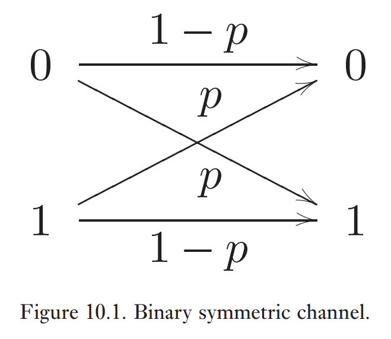

**Exemple (Amortissement d'amplitude) (Suite):**

$$
B = \begin{pmatrix}
1 & 0 & 0 & 0 \\
0 & \cos(\theta) & -\sin(\theta) & 0 \\
0 & \sin(\theta) & \cos(\theta) & 0 \\
0 & 0 & 0 & 1
\end{pmatrix}.
$$

$$ 
B \ket{0} (a\ket{0}+b\ket{1}) = a\ket{00} + b\cos(\theta)\ket{01} + b\sin(\theta)\ket{10} = \rho''
$$
$$
\begin{align}
(a\ket{0} + b\ket{1})\ket{0} &\to a\ket{00} + b\cos(\theta)\ket{10} + bin(\theta)\ket{11} \\
&\to a\ket{00} + b\cos(\theta)\ket{10} + b\sin(\theta)\ket{10} = \rho'
\end{align}
$$
Donc, on obtient que $\mathrm{Tr}_{E}(\rho') = \mathrm{Tr}_{E}(\rho'')$.

$$
\begin{align}
E_{j} &= \braket{ j_{E} | B | 0_{E} } \\
E_{0} &= \braket{ 0_{E} | B  | 0_{E} } = \ket{0}\bra{0} + \cos(\theta)\ket{1}\bra{1} = \begin{pmatrix}
1 & 0 \\
0 & \cos(\theta)
\end{pmatrix} \\
E_{1} &= \braket{ 1_{E} | B | 0_{E} } = \sin(\theta)\ket{0}\bra{1} = \begin{pmatrix}
0 & \sin(\theta) \\
0 & 0
\end{pmatrix}
\end{align}
$$

**Exemple (Amortissement de phase):**

$$
E_{0} = \begin{pmatrix}
1 & 0 \\
0 & \cos(\theta)
\end{pmatrix}, \
E_{1} = \begin{pmatrix}
0 & 0 \\
0 & \sin(\theta)
\end{pmatrix}
$$

# Introduction à la correction d'erreur

Un canal d'erreur classique peut ressembler à cela (canal de bit flip):

Classiquement, on peut encoder des bits à l'aide de la répétition de bit à l'aide de *code de répétition*. Par exemple,

$$
\begin{align}
0 \to 000 \\
1 \to 111
\end{align}
$$

On effectue par le suite un vote de majorité pour décider de la correction à appliquer. On a que

$$
\mathbb{P}(\text{ 2 erreurs ou plus }) = 3p^{2}(1-p) + p^{3} = p_{e}
$$

Si $p < \frac{1}{2}$, alors $P_{e} < P$.

Quantiquement, cela est plus difficile en raison du théorème de non-clonage.

**Théorème (non-clonage):** Il n'existe pas d'opérateur $U$ unitaire tel que $U\ket{\psi}\ket{0} = \ket{\psi}\ket{\psi}$.

Il n'est alors pas possible de faire $\ket{\psi} \to \ket{\psi}\ket{\psi}\ket{\psi}$. De plus, les erreurs sont continues. Est-ce qu'il faut donc une quantité de ressources infinies pour détecter et corriger les erreurs quantiques. Aussi, la mesure détruit l'état: $M(a\ket{0} + b\ket{1})= 0 \text{ ou } 1$.

## Code bit flip à trois qubits

Le canal d'erreur *bit flip* applique une porte $X$ avec une probabilité $p$.

$$
\varepsilon(\rho) = (1-p) \rho + \rho X\rho X
$$

Le *code de bit flip* pour trois qubits encode l'information de la manière suivante:

$$
\begin{align}
\ket{0} &\to \ket{0_{L}} = \ket{000} \\
\ket{1} &\to \ket{1_{L}} = \ket{111}
\end{align}
$$

Donc, $a\ket{0} + b\ket{1} \to a\ket{0_{L}} + b\ket{1_{L}} = a\ket{000} + b\ket{111}$.

**Opérateurs de mesure:**

$$
\begin{align}
\hat{P}_{0} &= \ket{000}\bra{000} + \ket{111}\bra{111} \\
\hat{P}_{1} &= \ket{100}\bra{100} + \ket{011}\bra{011} \\
\hat{P}_{2} &= \ket{010}\bra{010} + \ket{101}\bra{101} \\
\hat{P}_{3} &= \ket{001}\bra{001} + \ket{110}\bra{110} 
\end{align}
$$

$\{ M_{m} \}$, $\sum_{m} M_{m}^{\dagger} M_{m} = \mathbb{1}$, $\ket{\psi} \to \frac{M_{m} \ket{\psi}}{\sqrt{ \braket{ \psi | M_{m}^{\dagger} M_{m }| \psi } }}$.

Si $\ket{\psi} = a\ket{100} + b\ket{011}$, l'état après la mesure est $\hat{P}_{1} = a\ket{100} + b\ket{011}$. Donc, après la mesure, l'état reste $\ket{\psi}$, parce que la mesure de $P_{j}$ nous donne de l'information juste sur l'erreur et non sur l'état. Si $\braket{ \psi | \hat{P}_{1} | \psi } = 1$, on applique $X_{1}$.

$$
a\ket{100} + b\ket{011}  \to^{ U } a\ket{000} + b\ket{111}
$$

**Définition:** La *fidélité* entre une matrice densité $\rho$ et un état pur $\ket{\psi}$ est

$$
F(\ket{\psi}, \rho) = \sqrt{ \braket{ \psi | \rho | \psi } } \in  [0, 1]
$$

Sans le code $a\ket{0} + b\ket{1}$, après le canal de bruit

$$
\begin{align}
\rho &= (1-p) \ket{\psi}\bra{\psi} + \rho X \ket{\psi}\bra{\psi}X \\
F(\ket{\psi}, \rho) &= \sqrt{ 1-p+p \braket{ \psi | X | \psi }^{2} } \geq \sqrt{ 1-p }
\end{align}
$$

La fidélité est minimale quand l'état $\ket{\psi} = \ket{0}, \ket{1}$, $F=\sqrt{ 1-p }$.

Le but de la correction d'erreur est de maximiser la fidélité avec laquelle l'information quantique est stockée ou communiquée. 

L'état après la correction est

$$
\begin{align}
\rho' &= [(1-p)^{3} + 3p(1-p)^{2}]\ket{\psi}\bra{\psi} + \overbrace{ \dots }^{ \text{ Termes avec 2 bits flips ou plus}} \\
F' &= \sqrt{ \braket{ \psi | \rho' | \psi } } \geq \sqrt{ (1-p)^{3} + 3p(1-p^{2}) }
\end{align}
$$

On ne considère que les termes avec 2 bit flip ou plus avec des opérateurs positifs. Donc, la probabilité de stockage s'améliore si $\rho < \frac{1}{2}$.

Une autre approche est de mesurer $Z_{1}Z_{2}$ et $Z_{2}Z_{3}$. Soit $\ket{\psi} = a\ket{010} + b\ket{101}$.

$$
\begin{align}
Z_{1}Z_{2} &= \overbrace{ + }^{ m_{+} } \overbrace{ (\ket{00}\bra{00} + \ket{11}\bra{11}) }^{ M_{+} } \otimes \mathbb{1} \overbrace{ - }^{ m_{-} }\overbrace{  (\ket{01}\bra{01} + \ket{10}\bra{10}) }^{ M_{-} } \otimes  \mathbb{1} \\
&= \sum_{m \in \{ \pm \}} m M_{m}
\end{align}
$$

où $\sum_{m} M_{m}^{\dagger} M_{m} = \mathbb{1}$. Donc,

$$
\begin{align}
Z_{1}Z_{2} \to +1 \text{ si } q_{1} = q_{2} \text{ et } -1 \text{ si } q_{1} \neq q_{2}
\end{align}
$$

Avec une haute probabilité, 

- $Z_{1}Z_{2} \to +1 \text{ et } Z_{2}Z_{3} \to +1 \implies \text{ pas d'erreur }$
- $Z_{1}Z_{2} \to -1 \text{ et } Z_{2}Z_{3} \to +1 \implies \text{ erreur sur } q_{1}$
- $Z_{1}Z_{2} \to -1 \text{ et } Z_{2}Z_{3} \to -1 \implies \text{ erreur sur } q_{2}$
- $Z_{1}Z_{2} \to +1 \text{ et } Z_{2}Z_{3} \to -1 \implies \text{ erreur sur } q_{3}$

Dans le cas $Z_{1}Z_{2} \to +1$ (pas d'erreur ou erreur sur $q_{3}$), on a que

$$
\begin{align}
a\ket{000} + b\ket{111} \text{ ou } a\ket{001} + b\ket{110}
\end{align}
$$

$$
\begin{align}
M_{+}(a\ket{000} + b\ket{111}) &= a\ket{000}+b\ket{111} \\
M_{+} (a\ket{001}+b\ket{110}) &= a\ket{001} + b\ket{110}
\end{align}
$$

Dans le cas $Z_{2}Z_{3} \to -1$ (erreur sur $q_{2}$ ou erreur sur $q_{3}$), on a que

$$
\begin{align}
a\ket{010} + b\ket{101} \text{ ou } a\ket{001} + b\ket{110}
\end{align}
$$

$$
Z_{2}Z_{3} = \mathbb{1} \otimes (\ket{00}\bra{00} + \ket{11}\bra{11}) - I \otimes (\ket{01}\bra{01} +\ket{10}\bra{10})
$$

$$
\begin{align}
M_{-}(a\ket{010} + b\ket{101}) &= a\ket{010}+b\ket{101} \\
M_{-} (a\ket{001}+b\ket{110}) &= a\ket{001} + b\ket{110}
\end{align}
$$

|    Erreur     | État                                                                          | Probabilité |
| :-----------: | ----------------------------------------------------------------------------- | ----------- |
| Pas d'erreur  | $a\ket{000}+b\ket{111}$                                                       | $P_{0}$     |
|  Une erreur   | $a\ket{001}+b\ket{110}$ $a\ket{010}+b\ket{101}$ $a\ket{100}+b\ket{011}$ | $P_{1}$     |
| Deux erreurs  | $a\ket{011}+b\ket{100}$ $a\ket{101}+b\ket{010}$ $a\ket{110}+b\ket{001}$ | $P_{2}$     |
| Trois erreurs | $a\ket{111}+b\ket{000}$                                                       | $P_{4}$     |

Donc, $P_{0} > P_{1} \gg P_{2} P_{3}$. 

## Code phase flip à trois qubits

Avec une probabilité $p$, on applique une porte $Z$: $a\ket{0}+b\ket{1} \to a\ket{0}-b\ket{1}$. Dans la base de $X$, $\{ \ket{+}, \ket{-} \}$, on a que $Z\ket{\pm} = \ket{\mp}$, donc c'est comme un bit flip. Alors, l'encodage sera 

$$
\begin{align}
\ket{0} &\to \ket{+++} \\
\ket{1} &\to \ket{---}
\end{align}
$$

On mesure les projecteurs

$$
\hat{P}'_{j} := H^{\otimes  3} \hat{P}_{j} H^{\otimes 3}
$$

Équivalemment, on mesure

$$
\begin{align}
H^{\otimes 3} Z_{1}Z_{2}H^{\otimes 3} &= X_{1}X_{2} \\
H^{\otimes 3} Z_{2}Z_{3} H^{\otimes 3} &= X_{2}X_{3}
\end{align}
$$

On a que $H_{i}X_{i}H_{i} = Z_{i}$. Donc, on dit que le code de bit flip et le code de phase flip sont unitairement équivalent. 

# Code de Shor

$$
\begin{align}
\ket{0} &\to \ket{+++}, \ \ket{+} \to \frac{1}{\sqrt{ 2 }} (\ket{000}+\ket{111}) \\
\ket{1} &\to \ket{---}, \ \ket{-} \to \frac{1}{\sqrt{ 2 }} (\ket{000} - \ket{111})
\end{align}
$$

$$
\begin{align}
\ket{0_{L}} &= \frac{1}{2\sqrt{ 2 }}[(\ket{000}+\ket{111})(\ket{000}+\ket{111})(\ket{000+111})] \\
{1_{L}} &= \frac{1}{2\sqrt{ 2 }}[(\ket{000}-\ket{111})(\ket{000}-\ket{111})(\ket{000-111})]
\end{align}
$$

Une erreur $X_{j}$ peut être détecté et corrigée, par example pour $X_{1}$, en mesurant $Z_{1}Z_{2}$ et $Z_{2}Z_{3}$. Aussi, pour $Z_{j}$, on détecte avec $X_{1}X_{2}X_{3}X_{4}X_{5}X_{6}$ et $X_{4}X_{5}X_{6}X_{7}X_{8}X_{9}$. Pour corriger, on applique $Z_{1}Z_{2}Z_{3}$, $Z_{4}Z_{5}Z_{6}$ ou $Z_{7}Z_{8}Z_{9}$. 

Si l'erreur $X_{1}Z_{1}$ se produit, on détecte $X_{1}$ avec $Z_{1}Z_{2}$ et $Z_{2}Z_{3}$ et on le corrige. Aussi, on détecte $Z_{1}$ avec $X_{1}X_{2}X_{3}X_{4}X_{5}X_{6}$ et $X_{4}X_{5}X_{6}X_{7}X_{8}X_{9}$ et on le corrige.

Supposons qu'une erreur arbitraire est appliquée sur $q_{1}$. On décrit cela avec une opération $\varepsilon(\rho) = \sum_{k} E_{k}\rho E_{k}^{\dagger}$. Supposons que l'état du qubit est encodé par $\ket{\psi} = a\ket{0_{L}}+b\ket{1_{L}}$ avant $\varepsilon$. Donc, après le bruit, on a

$$
\begin{align}
\varepsilon(\ket{\psi}\bra{\psi}) &= \sum_{k} E_{k} \ket{\psi}\bra{\psi}E_{k}^{\dagger}
\end{align}
$$

On a aussi que

$$
E_{k} = e_{i_{0}}I_{1} + e_{i_{1}} X_{1} + e_{j_{2}}Z_{1} + e_{i_{3}}X_{1}Z_{1}
$$

Donc, l'état (pas normalisé) $E_{k} \ket{\psi}$ est une superposition des états $\ket{\psi}$, $X_{1}\ket{\psi}$, $Z_{1}\ket{\psi}$, $X_{1}Z_{1}\ket{\psi}$. Mesurer le *syndrome*, i.e. où est-ce que l'erreur se trouve, de l'erreur fait s'effondrer l'état en un des quatres états précédents. Si on obtient $Z_{1}\ket{\psi}$, on applique $Z_{1}$ par exemple. Le même processus s'applique pour chaque $E_{i}$.

*On peut corriger une infinité d'erreurs en corrigeant une quantité discrète d'erreurs.*