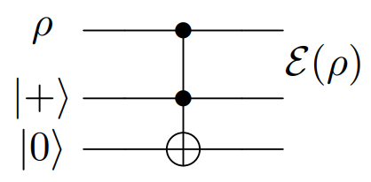

# Révision Intra

## Matrice densité

Pour un état pur, on a que $\rho = \ket{\psi}\bra{\psi}$ et $\mathrm{Tr}(\rho^{2}) = 1$. Pour un état mixte, on a que $\{ p_{k}, \ket{\psi_{k}} \}_{k=1}^{N}$ et $\mathrm{Tr}(\rho^{2}) < 1$.

On peut écrire que $\rho = \sum_{k}^{N} p_{k} \ket{\psi_{k}}\bra{\psi_{k}}$. On a aussi les propriétés suivantes:

1. $\rho ^{\dagger} = \rho$
2. $\mathrm{Tr}(\rho) = 1$

**Théorème:** Pour une matrice $\rho$ hermitienne, $\rho$ est une matrice densité $\rho = \sum_{k=1}^{N} p_{k} \ket{\psi_{k}}\bra{\psi_{k}}$ si et seulement si:

1. $\mathrm{Tr}(\rho) = 1$
2. $\rho$ est un opérateur positif

Une matrice hermitienne est un opérateur positif si les éléments de la matrice diagonalisée sont positifs.

**Exemple:** $\begin{pmatrix}1-p & p \\ p & p\end{pmatrix}$ est une matrice densité seulement si $p = 0$. En effet, on a bien que $\mathrm{Tr}(\rho) = 1$ et que $\rho = \begin{pmatrix}1-p & p \\ p & p\end{pmatrix} = U \begin{pmatrix} a & 0 \\ 0 & b\end{pmatrix}U^{\dagger}$ où $a,b\geq 0$.

Soit $\ket{\psi'} = U \ket{\psi}$. L'évolution de la matrice densité est donnée par $\rho' = U\rho U^{\dagger}$.

**Exemple:**

$$
\begin{align}
\rho &= \frac{1}{2} I \otimes  \ket{+}\bra{+} \\
\rho' &= H_{1} \rho H_{1}^{\dagger} \\
\rho'' &= CX H_{1} \rho H_{1}^{\dagger} CX^{\dagger}
\end{align}
$$
*Rajouter le reste.*
## Opérations quantiques

**Définition (1):** 
$$
\begin{align}
\varepsilon (\rho) &= \mathrm{Tr}_{E}(U(\rho \otimes \ket{0}\bra{0})U^{\dagger}) \\
&= \sum_{k} \braket{ e_{k} | U(\rho \otimes  \ket{0}\bra{0})U^{\dagger} | e_{k} } \\
&= \sum_{k} \braket{ e_{k} | U \ket{0} \rho \bra{0} U^{\dagger} | e_{k} }
\end{align}
$$

**Définition (2):** $\varepsilon(\rho) = \sum_{k}E_{k}\rho E_{k}^{\dagger}$ tel que $\sum_{k} E_{k}^{\dagger}E_{k} \leq I$. On nomme cela la représentation de Kraus. $\{ E_{k} \}$ sont appelés les opérateurs de Kraus.

**Définition (3):** Soit $Q_{1} = \{ \text{ Espace des matrices densité de dimension N } \}$ et $Q_{2} = \{ \text{ Espace des matrices densité de dimension M } \}$. Alors, pour $\varepsilon: Q_{1} \to Q_{2}$, on a que

- **A1** - $0 \leq \mathrm{Tr}(\varepsilon(\rho))$
- **A2** - $\varepsilon\left( \sum_{k} p_{k} \rho_{k} \right) = \sum_{k} p_{k} \varepsilon(\rho_{k})$
- **A3** - Si $\rho$ est un opérateur positif, $\varepsilon(\rho)$ est un opérateur positif. $(I \otimes \varepsilon)(A)$ est un opérateur positif si $A$ est un opérateur positif.

**Exemple:**

Il faut être capable de trouver $\varepsilon(\rho)$ à l'aide des définitions données.

**Théorème:** Les définitions (1), (2) et (3) des opérations quantiques $\varepsilon$ sont équivalentes.

On a vu plusieurs types d'erreurs quantiques:

- **Bit flip:** $\varepsilon(\rho) = (1-p)\rho + pX\rho X$
- **Phase flip:** $\varepsilon(\rho) = (1-p)\rho + pZ \rho Z$
- **Canal dépolarisant:** $\varepsilon(\rho) = (1-p)\rho + \frac{p}{2}I = (1-p)\rho + \frac{p}{3} (X \rho X + Y \rho Y + Z \rho Z)$

*Rajouter le dessin.*

$(1-p)\hat{P}_{0} + p \hat{P}_{1}$

On a aussi vu l'amortissement d'amplitude.

$$
\begin{align}
E_{0} = \begin{pmatrix}
1 & 0 \\
0 & \cos\theta
\end{pmatrix} \\
E_{1} = \begin{pmatrix}
0 & \sin\theta \\
0 & 0
\end{pmatrix}
\end{align}
$$

## Correction d'erreur

Classiquement, on a que

On peut utiliser un code de répétition $0 \to 000$ et $1 \to 111$ pour encoder l'information.

Un $[n,k]$-code linéaire est décrit par une matrice génératrice $G \in \text{Mat}_{\mathbb{Z}_{2}}(k,n)$.

Quantiquement, on a plusieurs problèmes

1. Théorème de non-clonage

Il n'existe pas de $U$ unitaire tel que $U\ket{\psi}\ket{0} = \ket{\psi}\ket{\psi}$. Par contre, on peut utiliser les codes de répétitions $\ket{0}_{L} = \ket{000}$, $\ket{1_{L}} = \ket{111}$ pour encoder l'état. Alors, on a que $\ket{\psi}=a\ket{0}+b\ket{1} \to a\ket{0_{L}+b\ket{1_{L}}}$.

2. La mesure détruit les états

Suite à la mesure, on a que $\ket{\psi} \to \{ 0, 1 \}$. Par contre, en utilisant les syndromes, comme $Z_{1}Z_{2}$ et $Z_{2}Z_{3}$ ne change pas l'état avec une haute probabilité. Faire cela nous donne de l'information seulement sur les erreurs et pas sur l'état. $\mathbb{P}(\text{Erreur sur au plus 1 qubit}) \gg \mathbb{P}(\text{Erreur sur plus de 1 qubit})$.

5. Les erreurs sont continues.

Soit l'erreur $\varepsilon(\rho) = (1-p) \rho + p X \rho X$ sur chaque qubit. Alors, le circuit de correction d'erreur est donné par

*Rajouter le dessin.*

Dans ce cas, $\mathcal{F}$ est l'opération quantique décrivant le bruit dans l'espace du code et $\mathcal{R}$ est l'opération quantique de récupération de l'état initial.

On peut corriger l'erreur $\mathcal{F}$ s'il existe $\mathcal{R}$ (préservant la trace) tel que $\mathcal{R}(\rho) = \sum_{k} R_{k} \rho R_{k}^{\dagger}$ où $\sum_{k}R_{k}^{\dagger}R_{k} = I$. On a alors que $(\mathcal{R} \circ \mathcal{F})(\rho) \propto \rho$.

**Théorème (Conditions de correction d'erreur quantique):** Soit $\mathcal{F}(\rho) = \sum_{k} F_{k} \rho F_{k}^{\dagger}$ et $P=\ket{0_{L}}\bra{0_{L}} + \ket{1_{L}}\bra{1_{L}}$. Alors,

$$
(\mathcal{R} \circ F)(\rho) \circ \rho \iff P F_{i}^{\dagger} F_{j} P = m_{ij} P
$$

où $m$ est une matrice hermitienne.

Soit $C_{1}$ un $[n,k_{1}]$-code linéaire, $C_{2}$ un $[n,k_{2}]$-code linéaire tel que $C_{2} \subset C_{1}$. $C_{1}$ et $C_{2}$ sont des espaces vectoriels sur $\mathbb{Z}_{2}$.

Soit $V$ est un espace vectoriel sur $\mathbb{Z}_{2}$.

$$
V = \braket{ \begin{pmatrix}
1 \\
1 \\
0
\end{pmatrix} }, \ V^{\dagger} = \braket{ \begin{pmatrix}
1 \\
1 \\
0
\end{pmatrix} , \ \begin{pmatrix}
0 \\
0 \\
1
\end{pmatrix} }
$$

Cela implique que $V \subset V^{\dagger}$. On peut construire l'espace vectoriel quotient $\frac{C_{1}}{C_{2}} = \{ x + C_{2} | x \in C_{1} \}$.

$$
\begin{align}
x + C_{2} = \{ x + y | y \in C_{2} \} \\
x + C_{2} = x' + C_{2} \iff x-x' \in C_{2}
\end{align}
$$

$$
\ket{x+C_{2}} = \frac{1}{\sqrt{ \lvert C_{2} \rvert  }} \sum_{y \in C_{2}} \ket{x + y}
$$

On peut montrer que $\{ \ket{x+C_{2}} | x \in C_{1} \}$ est une base orthonormée. Cela nous donne le code $CSS(C_{1}, C_{2})$, qui peut corriger n'importe quelle erreur. Pour faire la preuve, on a fait

$$
\begin{align}
\ket{x + C_{2}} = \ket{x' + C_{2}} \iff x-x' \in C_{2} \\
\braket{ x+C_{2} | x'+C_{2} } = \delta_{xx'}
\end{align}
$$

## Théorie des groupes

**Définition:** Un groupe est un ensemble $G \neq \emptyset$ avec une opération $*: G \times G \to G$ tel que

1. $(a*b)*c=a*(b*c)$
2. $\exists e_{G} \in G$ tel que $e_{G}*a=a*e_{G}=a \ \forall \ a \in G$
3. $\ \forall \ a \in G \exists a^{-1} \in G$ tel que $a*a^{-1}=a^{-1}*a=e_{G}$

**Définition:** Un homomorphisme de groupe est une fonction $f: (G,*) \to (H, \circ)$ tel que $f(a*b) = f(a) \circ f(b) \ \forall \ a, b \in G$.

**Proposition:**

- (a) - $f(e_{G})=e_{H}$
- (b) - $f(a^{-1}) = f(a)^{-1} \ \forall \ a \in G$

**Définition:** Un sous-groupe de $G$ est un sous-ensemble $S$ tel que

1. $x, y \in S \implies x*y \in S$
2. $x \in S \implies x^{-1} \in S$

**Proposition:** Si $S<G$ (sous-groupe), alors $S$ est un groupe.

**Proposition:** Si $f: (G, *) \to (H, \circ)$ est un homomorphisme, alors

$$
\text{Ker}(f) = \{ g \in G | f(g) = e_{H} \}
$$

est un sous-groupe de $G$.

**Preuve:** $f(e_{G}) = e_{H}$, donc $e_{G} \subset \text{Ker}(f) \implies \text{Ker}(f) \neq \emptyset$. Si $x,y \in \text{Ker}(f)$, $f(x)=e_{H}$ et $f(y) = e_{H}$, alors,

$$
f(x*y) = f(x) \circ f(y) = e_{H} \circ e_{H} = e_{H} \implies x*y \in \text{Ker}(f)
$$

Si $x \in \text{Ker}(f)$, $f(x) = e_{H}$.

$$
\begin{align}
f(x)^{-1} &= e_{H}^{-1} = e_{H} \\
f(x^{-1}) &= e_{H} \implies x^{-1} \in \text{Ker}(f)
\end{align}
$$