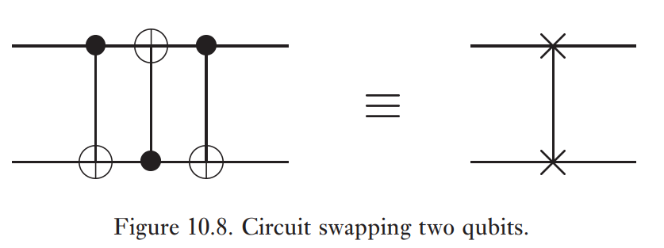

Soit $S=\braket{ g_{1}, \dots, g_{k} }$ commutatif, $-I \notin S$, des générateurs indépendants et $\ket{\psi} \in V_{S} \setminus \{ \vec{0} \}$. Soit $U$ un opérateur unitaire à $n$ qubits.

$$
\begin{align}
U\ket{\psi} &= Ug_{j}\ket{\psi} \\
&= (Ug_{j}U^{\dagger})U\ket{\psi}
\end{align}
$$
$U\ket{\psi}$ est stabilisé par $Ug_{j}U^{\dagger}$.

L'espace vectoriel

$$
UV_{S} = \{ U\ket{\psi} \mid \ket{\psi} \in V_{S} \}
$$

est stabilisé par le groupe

$$
USU^{\dagger} = \{ UgU^{\dagger} \mid g \in S \} = \braket{ Ug_{j}U^{\dagger} \mid j=1,\dots, k }
$$

*Rajouter les dessins des circuits.*

Pour 

$$
\begin{align}
Ux_{1} &= (\ket{0}\bra{0} \otimes  I + \ket{1}\bra{1}\otimes X) (\ket{0}\bra{1} + \ket{1}\bra{0}) \otimes I \\
&= \ket{0}\bra{1} \otimes  I + \ket{1}\bra{0} \otimes  X
\end{align}
$$

$$
\begin{align}
UX_{1}U^{\dagger} &= \dots \\
&= \ket{0}\bra{1} \otimes  X + \ket{1}\bra{0} \otimes  X \\
&= X \otimes X \\
&= X_{1}X_{2}
\end{align}
$$

$$
UZ_{2}U^{\dagger} = Z_{1}Z_{2}
$$

Donc, $\frac{1}{\sqrt{ 2 }} (\ket{00} + \ket{11})$ et $-\frac{1}{\sqrt{ 2 }} (\ket{00} + \ket{11})$

Pour trouver l'état correspondant aux stabilisateurs, il faut trouver les valeurs et vecteurs propres de l'espace des stabilisateurs (?).

$$
\begin{align}
UX_{1}U^{\dagger} &= X_{1}X_{2} \\
UZ_{2}U^{\dagger} &= Z_{1}Z_{2} \\
UX_{2}U^{\dagger} &= X_{2} \\
UZ_{1}U^{\dagger} &= Z_{1}
\end{align}
$$

$$
\begin{align}
UY_{2}U^{\dagger} &= -iUZ_{2}X_{2}U^{\dagger} \\
&= -i U Z_{2} U^{\dagger} UX_{2}U^{\dagger} \\
&= -i Z_{1} Z_{2} X_{2} \\
&= Z_{2}Y
\end{align}
$$

$$
\begin{align}
G_{1} &= \braket{ X_{1},Z_{1} } \\
G_{2} &= \braket{ X_{1},X_{2},Z_1,Z_{2} } \\
G_{n} &= \braket{ X_{j}, Z_{j} \mid j=1,\dots ,n }
\end{align}
$$

Pour $S = \begin{pmatrix}1 & 0 \\ 0 & i\end{pmatrix}$, on a que $SXS^{\dagger}=Y$ et que $SZS^{\dagger} = Z$é

En fait, toutes les opérations qui transforment les éléments de $G_{n}$ à des éléments de $G_{n}$ par conjugaison peuvent être formées par composition des portes $H$, $S$, $CNOT$.

On se rappelle que $N_{G}(S) = \{ E \in G \mid EgE^{-1} \in S \}$. Ici, on a que

$$
\begin{align}
N_{U(2^{n})}(G_{n}) &= \{ U \in U(2^{n}) \mid UgU^{\dagger} \in G_{n} \ \forall \  g \in G_{n} \} \\
&= \braket{ \underbrace{ H_{j}, S_{j}, CX(i,j) }_{ \text{Portes de normalisation} } \mid i,j=1,\dots,n }
\end{align}
$$

**Exemple:** 

$$
\begin{align}
Z_{1} \to Z_{1} \to Z_{1}Z_{2} \to Z_{1}Z_{1}Z_{2} = Z_{2} \\
Z_{2} \to \dots \to Z_{1} \\
X_{1} \to \dots \to X_{2} \\
X_{2} \to \dots \to X_{1}
\end{align}
$$

**Théorème:** Si $U \in N(G_{n})$, $U$ peut être composée de $O(n^{2})$ portes $H$, $S$, $CNOT$ à une phase globale près. 

La porte $U = CCNOT_{1 \text{ et } 2 \to 3}$ n'est pas dans $N(G_{n})$.

$$
\begin{align}
UZ_{1}U^{\dagger} &= Z_{1} \\
UX_{1}U^{\dagger} &= X_{1} \otimes  \frac{1}{2}(1+Z_{2}+X_{3}-Z_{2}X_{3})
\end{align}
$$

La porte $T = \begin{pmatrix}1 & 0 \\ 0 & e^{i\pi/4}\end{pmatrix}$ n'est pas dans $N(G_{n})$.

$$
\begin{align}
TZT^{\dagger} &= Z \\
TXT^{\dagger} &= \frac{1}{\sqrt{ 2 }} (X+Y)
\end{align}
$$

*Rajouter le dernier exemple.*

## Mesures dans le formalisme des stabilisateurs

Dans la base computationnelle, supposons qu'on mesure $g \in G_{n}$ (hermitien) n'ayant pas de facteurs $-1, \pm i$. Notre système est dans l'état $\ket{\psi}$ avec les stabilisateurs $g_{1}, \dots, g_{n}$.

On a deux possibilités:

**Possibilité 1:** $[g,g_{j}] = 0 \ \forall \ j$

$$
\begin{align}
g_{j}g\ket{\psi} &= gg_{j}\ket{\psi} \\
&= g\ket{\psi}
\end{align}
$$
$S = \braket{ g_{1}, \dots, g_{n-k} }$ avec $\text{dim}_{\mathbb{C}}V_{S} = 2^{k}$. On a que $\text{dim}_{\mathbb{C}}V_{S} = 2^{0} = 1$ ce qui implique que $g\ket{\psi} = \in V_{S}$ et donc que $g\ket{\psi} = \pm \ket{\psi}$ ($g^{2} = I$).

Si on mesure $g$ dans le cas $g\ket{\psi} = \ket{\psi}$, on obtient $+1$ avec une probabilité $1$. Si $g \ket{\psi} = \ket{\psi}$ avec $-g \in S$, on obtient $-1$ avec une probabilité $1$. Ces mesures ne changent pas l'état.

**Exemple:** Pour l'état de Bell, $S = \braket{ X_{1}X_{2}, Z_{1}Z_{2} }$, $g=Z_{1}Z_{2}$. On a que $[g,Z_{1}Z_{2}]=[g,X_{1}X_{2}]=0$. On obtient $\frac{1}{\sqrt{ 2 }} (\ket{00}+\ket{11})$.

$$
\mathbb{P}_{\ket{\psi}}(+1) = \braket{ \psi | \frac{I+g}{2} | \psi } = \frac{1}{2} + \frac{1}{2} = 1
$$

**Possibilité 2:** $\exists j \ \{ g,g_{j} \} = 0$. Supposons que $\{ g,g_{1} \} = 0$. 

$$
S = \braket{ g_{1}, g_{2}, \dots, g_{n} }
$$

Si $\{ g,g_{2} \}=0$,

$$
gg_{1}g_{2} = -g_{1}gg_{2} = g_{1}g_{2}g \implies [g,g_{1}g_{2}]=0
$$

$$
S = \braket{ g_{1},g_{1}g_{2},g_{3}, \dots, g_{n} }
$$

On peut supposer que $g$ anti-commute avec seulement $g_{1}$ et $[g,g_{j}]=0 \ \forall \ j\geq_{2}$. 

$$
g = + \frac{1}{2}(I+g) - \frac{1}{2} (I-g)
$$

$$
\begin{align}
\mathbb{P}_{\ket{\psi}}(+1) &= \mathrm{Tr}\left( \frac{1}{2}(I+g)\ket{\psi}\bra{\psi} \right) \\
&= \mathrm{Tr}\left( \frac{1}{2}(I+g)g_{1}\ket{\psi}\bra{\psi} \right) \\
&= \mathrm{Tr}\left( g_{1} \frac{1}{2}(I-g)\ket{\psi}\bra{\psi} \right) \\
&= \mathrm{Tr}\left( \frac{1}{2}(I-g) \ket{\psi}\bra{\psi} g_{1} \right) \\
&= \mathrm{Tr}\left( \frac{1}{2}(I-g) \ket{\psi}\bra{\psi} \right) \\
&= \mathbb{P}_{\ket{\psi}}(-1)
\end{align}
$$

Donc, on trouve que $\mathbb{P}_{\ket{\psi}}(+1) = \mathbb{P}_{\ket{\psi}}(-1)=\frac{1}{2}$. Supposons qu'on mesure $+1$,

$$
\ket{\psi^{+}} = \frac{1}{\sqrt{ \frac{1}{2} }} \frac{1}{2} (I+g) \ket{\psi} = \frac{1}{\sqrt{ 2 }}(I+g)\ket{\psi}
$$
Son stabilisateur est $\braket{ g,g_{2},\dots,g_{n} }$ car

$$
\begin{align}
g\ket{\psi^{+}}&= \frac{g}{\sqrt{ 2 }} (I+g) \ket{\psi} = \frac{g+g^{2}}{\sqrt{ 2 }}\ket{\psi} = \ket{\psi^{+}} \\
g_{j} \ket{\psi^{+}} &= g_{j} \frac{1}{2}(I+g) \ket{\psi} = \frac{1}{\sqrt{ 2 }}(g_{j}\ket{\psi} + g_{j}g\ket{\psi}) = \frac{1}{\sqrt{ 2 }}(\ket{\psi}+g\ket{\psi}) = \ket{\psi^{+}}
\end{align}
$$

Si on mesure $-1$, 

$$
\ket{\psi^{-}} = \frac{1}{2}(I-g) \ket{\psi}
$$

Son stabilisateur est $S = \braket{  g, g_{2}, \dots, g_{n} }$.

$S = \braket{ X_{1}X_{2},Z_{1}Z_{2} }$, $g=Z_{1}$. ${g,X_{1}X_{2}}=[g,Z_{1}Z_{2}]=0$. $\mathbb{P}_{\ket{\psi}}(+1)=\mathbb{P}_{\ket{\psi}}(-1)=\frac{1}{2}$.

## Théorème de Gottesman-Knill

**Théorème:** Supposons qu'un calcul quantique soit effectué en impliquant

1. Préparation d'états dans la base computationnelle.
2. $H, S, CX, P \in G_{n}$.
3. Mesure de $P \in G_{n}$.
4. Contrôle classique conditionné par le résultat de ces mesures.

Un tel calcul peut être simulé efficacement sur un ordinateur classique.

**Preuve:** Suivre les générateurs des stabilisateurs.

## Construction de codes stabilisateurs

**Définition:** Un $[n,k]$-code stabilisateur est un espace vectoriel $V_{S} = C(S)$ qui est stabilisé par un sous-groupe $S = \braket{ g_{1},\dots,g_{n-k} }$ avec des générateurs indépendants et abélien ainsi que $-I \in S$. 

$\braket{ g_{1}, \dots, g_{n-k}} \to G_{n} \to ^{r} \mathbb{Z}_{2}^{2n}$

1. Compléter un ensemble de générateurs indépendants et commutant 

$$
\braket{ g_{1},\dots,g_{n-k}, \bar{Z}_{1}, \dots, \bar{Z}_{k} }
$$

2. On veut que $\bar{Z}_{j}$ agisse comme la porte logique $Z$ sur le qubit $j$. Donc, l'état logique dans la base computationnelle $\ket{x_{1}, \dots, x_{k}}_{L}$ est l'état stabilisé par
 
$$
\braket{ g_{1}, \dots, g_{n-k}, (-1)^{x_{1}} \bar{Z}_{1}, \dots, (-1)^{x_{k}} \bar{Z}_{k} }
$$

3. Soit $\bar{x}_{j}$ tel que $\bar{X}_{j}\bar{Z}_{j}\bar{X}_{j}^{\dagger} = -\bar{Z}_{j}$ et $\bar{X}_{j}\bar{Z}_{i}\bar{X}_{j}^{\dagger} = -\bar{Z}_{i} \ \forall \ i \neq j$ et $\bar{X}_{j}g_{i}\bar{X}_{j}^{\dagger} = -g_{i} \ \forall \ j$. On a que $\bar{x}_{j}^{\dagger} = \bar{x}_{j}$.

Quelle est la relation entre les propriétés de correction d'erreurs et les générateurs de stabilisateur? Supposons que l'erreur $E \in G_{n}$ se produise dans un $[n,k]$-code stabilisateur, avec $S = \braket{ g_{1},\dots,g_{n-k} }$. 

**Cas 1:** $\exists g_{j}$ tel que $\{ g_{j}, E \} = 0$. $C(S) = \text{span}\{ \ket{000}, \ket{111} \}$. $S = \braket{ Z_{1}Z_{2},Z_{2}Z_{3} }$, $E=X_{3}$.

$$
E\ket{\psi} = a\ket{001} + b\ket{110}
$$
$\{ X_{3}, Z_{2}Z_{3} \} = 0$, $[X_{3}, Z_{1}Z_{2}]=0$.

$$
E \cdot C(S) = \{ E\ket{\psi} \mid \ket{\psi} \in C(S) \}
$$

On peut mesurer les générateurs pour trouver l'erreur et la corriger.

**Cas 2:** $E \in S \implies E\ket{\psi} = \ket{\psi}$

**Cas 3:** $[g_{j}, E] = 0 \ \forall \ j$ et $E \notin S$

**Lemme:** Si $S < G_{n}$ et $-I \notin S$, alors $N(S) = Z(S)$. On sait que

$$
\begin{align}
Z(S) &= \{ E \in G_{n} \mid E g_{j} = g_{j} E \ \forall \  j \} \\
N(S) &= \{ E \in G_{n} \mid E g_{j} E^{\dagger} \in S \ \forall \  j\}
\end{align}
$$

**Preuve:** 

- $Z(S) \subseteq N(S)$

Si $E \in Z(S)$, $Eg_{j}=g_{j}E \ \forall \ j$, alors $Eg_{j}E^{\dagger}=g_{j} \in S$ et donc $E \in N(S)$.

- $N(S) \subseteq Z(S)$

Si $E \in N(S)$, et $E \notin Z(S)$, $\exists j$ tel que $Eg_{j} = -g_jE$.

$$
\begin{align}
\implies& Eg_{j}E^{\dagger} = -g_{j} \in S \\
\implies& g_{j}, -g_{j} \in S \\
\implies& -g_{j}g_{j} = -g_{j}^{2} = -I \in S
\end{align}
$$

Contradiction! $\square$