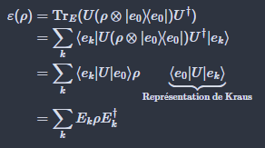

- [x] Comment trouver la matrice densité réduite à partir à l'aide de la trace partielle dans le numéro 2a du devoir 1? Est-ce que cela est vrai?
$$
\mathrm{Tr}_{2}(\rho_{1} \otimes  \rho_{2}) = \rho_{1} \otimes  \mathrm{Tr}(p_{2}) = \mathrm{Tr}(\rho_{2}) \rho_{1} =\rho_{1}
$$

- Oui, l'équation est vraie.

 - [x] Pourquoi est-ce qu'on peut passer de l'équation 2 à 3?

- Comme on trace sur l'environnement, alors on peut étudier d'abord l'effet de $U$ sur les états d'environnements. Ensuite, en effectuant la trace, $U$ sera appliquée sur la matrice densité $\rho$. Voir Devoir 1 Problème 4(b).

- [ ] Dans la preuve du théorème 10.1, pourquoi est-ce que le projecteur P disparaît à la ligne (10.23). Si on dit que c'est parce que $\rho$ est déjà dans l'espace de code, alors pourquoi est-ce qu'on a l'équation (10.27).

- [ ] Est-ce qu'il y a une autre manière de construire explicitement une opération de correction d'erreur $\mathcal{R}$ outre que le théorème 10.1?

- [ ] Est-ce qu'il suffit de construire les $F$ avec une combinaison linéaire des $E$? Si oui, ça revient pas à avoir $E=F$ et donc une seule opération au lieu d'une infinité?

- [ ] Est-ce qu'on a des examples d'opérations quantiques différentes?

- [ ] Est-ce qu'on a des examples de récupération différents?

- [ ] Est-ce que le canal d'erreur bit flip est la même opération quantique que le canal d'erreur dépolarisant, en sachant que $E_{i} = \sum_{j} \mu_{ij} F_{j}$ (théorème 8.2). 

- [ ] $H=\{ I,X \}$ peut engendrer $G_{1}$?  

