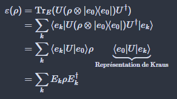

- [x] Comment trouver la matrice densité réduite à partir à l'aide de la trace partielle dans le numéro 2a du devoir 1? Est-ce que cela est vrai?
$$
\mathrm{Tr}_{2}(\rho_{1} \otimes  \rho_{2}) = \rho_{1} \otimes  \mathrm{Tr}(p_{2}) = \mathrm{Tr}(\rho_{2}) \rho_{1} =\rho_{1}
$$
Oui, l'équation est vraie.

 - [ ] Pourquoi est-ce qu'on peut passer de l'équation 2 à 3?

Comme on trace sur l'environnement, alors on peut étudier d'abord l'effet de $U$ sur les états d'environenments. Ensuite, en effectuant la trace, $U$ sera appliquée sur la matrice densité $\rho$.

